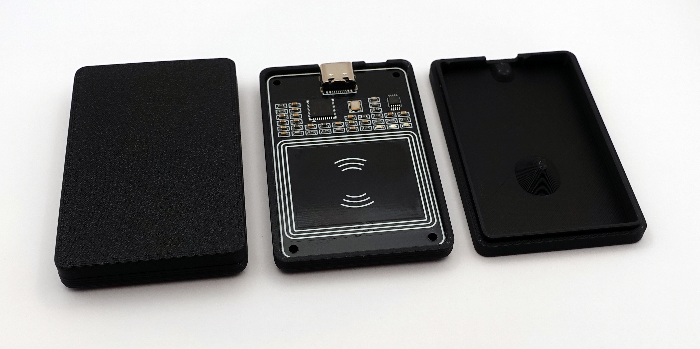

I have now released the design files for the Zaparoo Zap Pad NFC reader case on GitHub. This case is compatible with the black PN532 NFC USB-C reader module.

The case is smaller and sturdier than the previous one and is a simple friction fit requiring no extra parts besides the module. I've also added a revision with some indents on the bottom for rubber feet, this one is designed for 0.6mm diameter feet.
STLs, STEP files, and Fusion 360 files are available and they're all open source and free to use for personal or commercial use. Have fun!

<Button
  icon={<FAIcon icon="fa-brands fa-github" />}
  label="Get model files"
  link="https://github.com/ZaparooProject/tapto-hardware/tree/main/zap-pad-case"
  variant="primary"
/>
