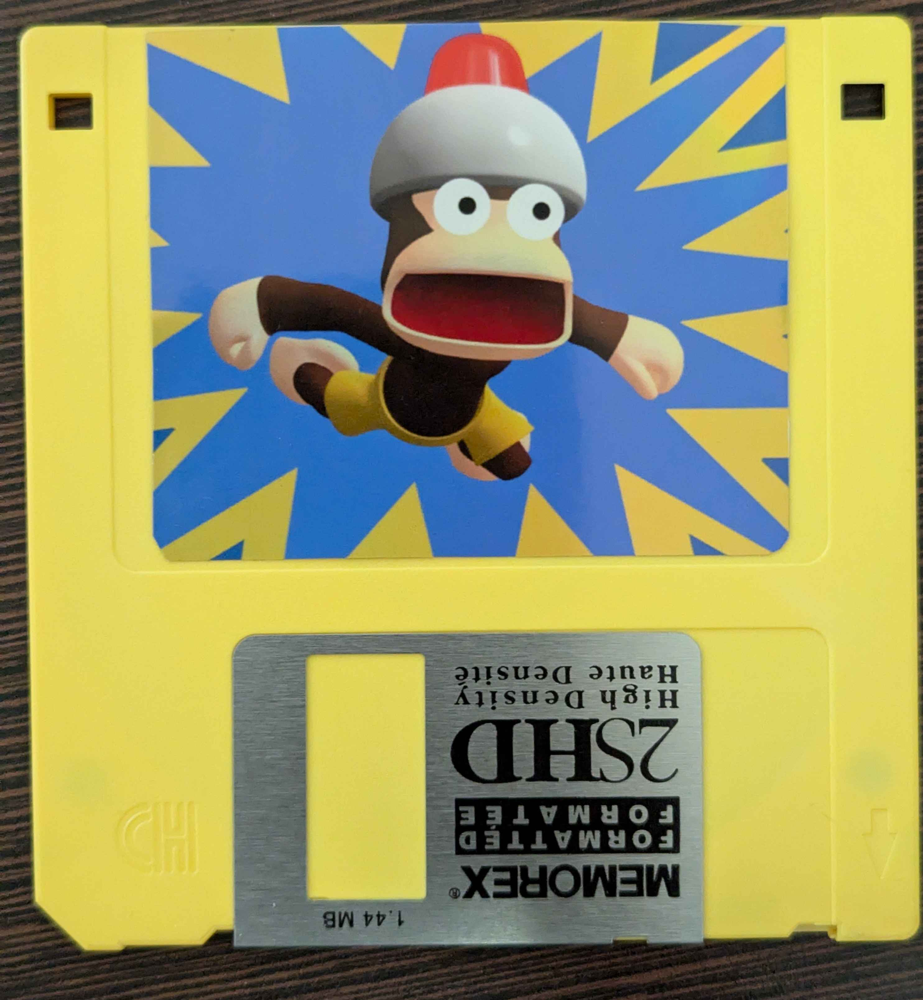

Developer [V1605](https://github.com/v1605) has joined the Zaparoo organization and has contributed some new projects for everyone to try out. These include a design for a wireless reader using an ESP32, a floppy drive project, and a base template for using the Zaparoo API in your own projects.

{/* truncate */}

V1605 has been working on heaps of cool and experimental ways to use Zaparoo. I hope to get some more eyes on these projects and see what the community can do with them! See the [Projects](/projects) page for links.
