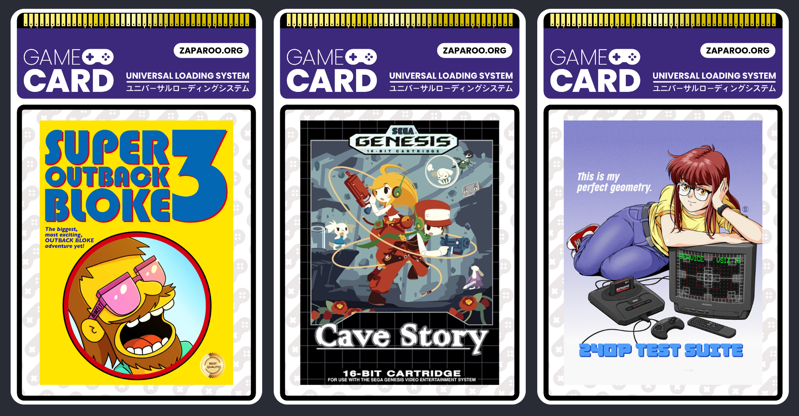
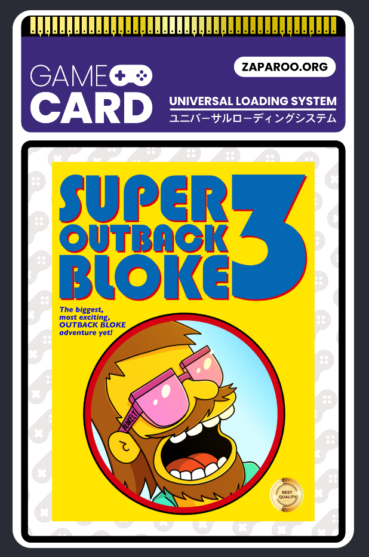
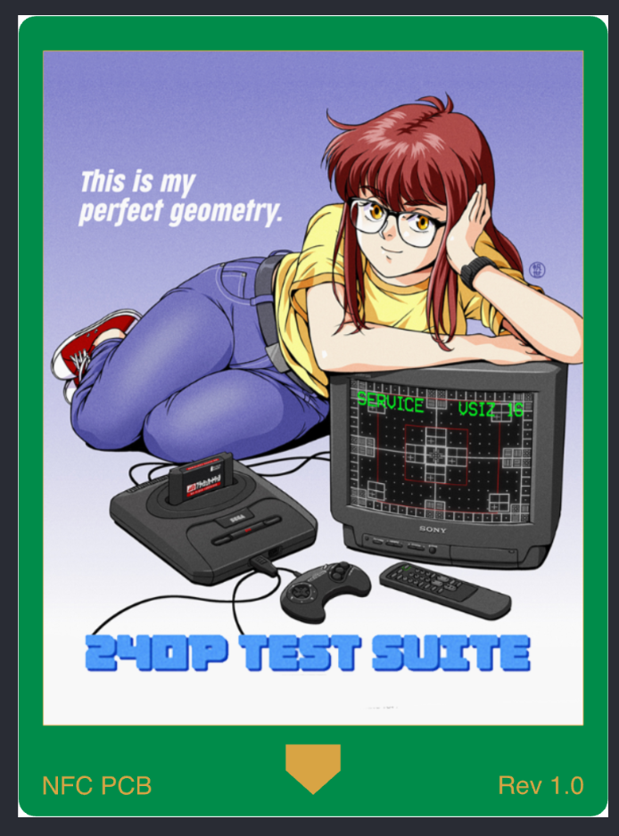
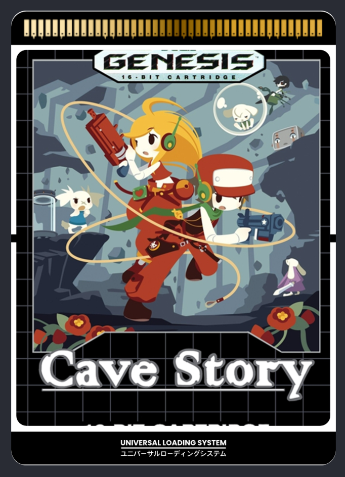

There are 2 new templates now available in the [Zaparoo Designer](https://design.zaparoo.org/) plus an updated version of an existing template. Please take a look below for a preview.

A huge thank you to [Asturur](https://github.com/asturur) and [Tim Wilsie](https://timwilsie.art/) for their continued contributions to the Designer. There are also some upcoming changes to the Designer itself, which will greatly improve the experience designing cards and creating your own templates. Stay tuned for more information on that!

## Game Cards

First up is the Game Card template by [Tim Wilsie](https://timwilsie.art/). This gorgeous template is first up in the long awaited post-TapTo design era. If you were waiting for a new template to start your Zaparoo collection, you can START RIGHT NOW!

## Retro Remake PCB Cards

Next is a template whipped up by myself. This template is in preparation for the upcoming [Retro Remake](https://retroremake.co/) PCB cards being released. It will help you create your own stickers exactly the right size to fit on the PCB cards.

## Upgrade Stickers

Finally, this is an updated version of an existing template that was meant for the original TapTo Trading Cards. This new set of templates give you lots of options to create the perfect size stickers which fit the official Zap Trading Cards.

This size is now standard, and will be used for all future official Zaparoo cards. You're welcome to adopt the sizing for your own designs, it makes it easy to print and apply stickers.

Have fun! And remember, if you have any questions or need help, please don't hesitate to ask in the [Zaparoo Discord](https://zaparoo.org/discord).

<Button
  icon={<FAIcon icon="link" />}
  label="Zaparoo Designer"
  link="https://design.zaparoo.org/"
  variant="primary"
/>
