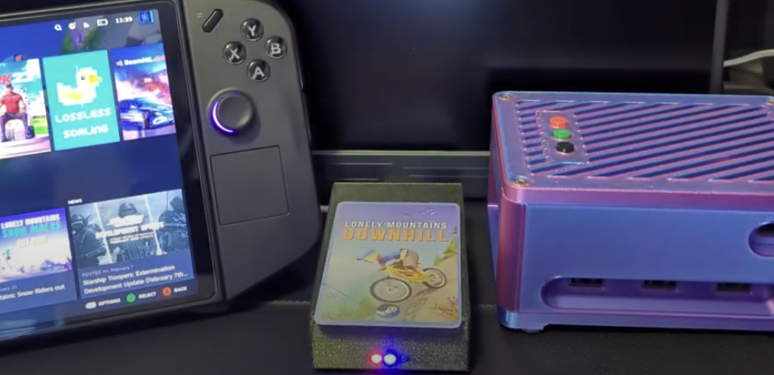

Thank you to [MintyTrebor](https://github.com/MintyTrebor) (welcome to the Zaparoo team!) and [V1605](https://github.com/v1605) for their hard work on this new release of ZapEsp32. This release includes a complete overhaul of the user interface, making it easier to use and more powerful than ever.

{/* truncate */}

ZapEsp32 is a project that allows you to build your own advanced wireless NFC reader using an ESP32 microcontroller, fully compatible with Zaparoo. It includes many features such as:

- Wireless NFC reading/writing on battery power
- Playing custom audio files direct from device
- Rumble motor support
- Launch from MiSTer and Steam from one device
- Built in mappings management

And lots more! Take a look at the video below by MintyTrebor to see it in action:

  <iframe
    src="https://www.youtube.com/embed//W_nQjJoirQA"
    frameborder="0"
    allowfullscreen
  ></iframe>

 

Want to try it out for yourself? You can find the build instructions on GitHub:

<Button
  icon={<FAIcon icon="fa-brands fa-github" />}
  label="ZapEsp32 on GitHub"
  link="https://github.com/ZaparooProject/zaparoo-esp32"
  variant="primary"
/>
