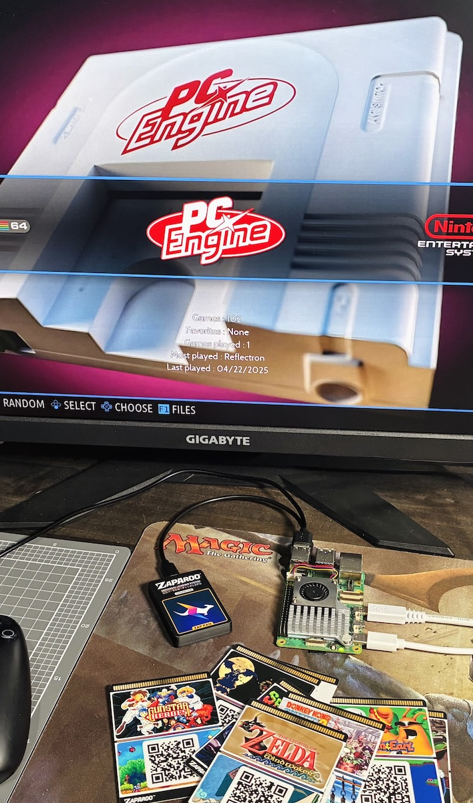

Zaparoo Core v2.3.0 is now available! Adds stable support for Batocera, revamps the playlist feature and adds heaps of smaller improvements.

{/* truncate */}

## Download

<Button
  icon={<FAIcon icon="download" />}
  label="Core v2.3.0"
  link="https://zaparoo.org/downloads#zaparoo-core"
  variant="primary"
/>

<Button
  icon={<FAIcon icon="fa-brands fa-github" />}
  label="GitHub"
  link="https://github.com/ZaparooProject/zaparoo-core/"
  variant="primary"
/>

## Batocera Support

The star of this release is the newest supported platform: [Batocera](https://batocera.org/)! Batocera is a software emulation distribution based around EmulationStation, with support for a huge number of systems and devices.

This went so well, I ended up marking this release as stable. It has almost the exact same level of support for all features as Zaparoo on [MiSTer](/docs/platforms/mister), including support for all the same hardware like NFC readers.

If you want to give it a shot, please take a look at the [Batocera platform guide](/docs/platforms/batocera) for install instructions. There are builds available for ARM, ARM64, x86_64 which should cover most of the devices Batocera works with.

Not much else to say here... it just works!!!

## Playlist Updates

The [playlist feature](/docs/zapscript/playlist) has been completely revamped to actually be useful now! This was a feature I threw in last minute a while ago, but it still needed a lot of love.

Originally, you could load a folder as a playlist with `**playlist.play:/some/folder` and then navigate between media with `**playlist.next` and `**playlist.prev`. It was neat but probably not very useful.

Now, we have some new commands:

- `**playlist.load` - Load a folder as a playlist without starting playback.
- `**playlist.stop` - Stop playback (exit the media) and clear the playlist.
- `**playlist.pause` - Stop playback without clearing the playlist.
- `**playlist.goto` - Jump to a specific item in the playlist and play it.
- `**playlist.open` - Load a playlist and **display a list picker on screen to choose which item to play**.

On top of that, the loading itself has been improved. Folder loading works a little better, but more importantly, playlist files are now supported in the .pls format.

With all these new features, suddenly playlists feel much more useful and natural. Please take a look at the [playlist documentation](/docs/zapscript/playlist) for more information, and _definitely_ give the `playlist.open` command a try! You will like it.

## Other Changes

- Prepared bases for further platform support.
- Overhauled build process to allow for easier platform support.
- Added support for searching `all` system in [launch.random command](/docs/zapscript/launch#launch.random).
- Added feature to allow setting a [portable directory](/docs/core/config) for Zaparoo config and data.
- Added support for scanning subfolders in [mappings folder](/docs/core/mappings).
- Fixed bug where uppercase Zap Links weren't being detected.
- Fixed bug where Core was sending incorrect media notifications to [App](/docs/app/).
- Added a flag to [run API method](/docs/core/api/methods#run) to mark scripts as unsafe.
- License and platform READMEs are now included with all releases.
- Build scripts now work natively on Windows.
- The `launcher` advanced argument can be used to override system auto-detection on [launch commands](/docs/zapscript/launch).
