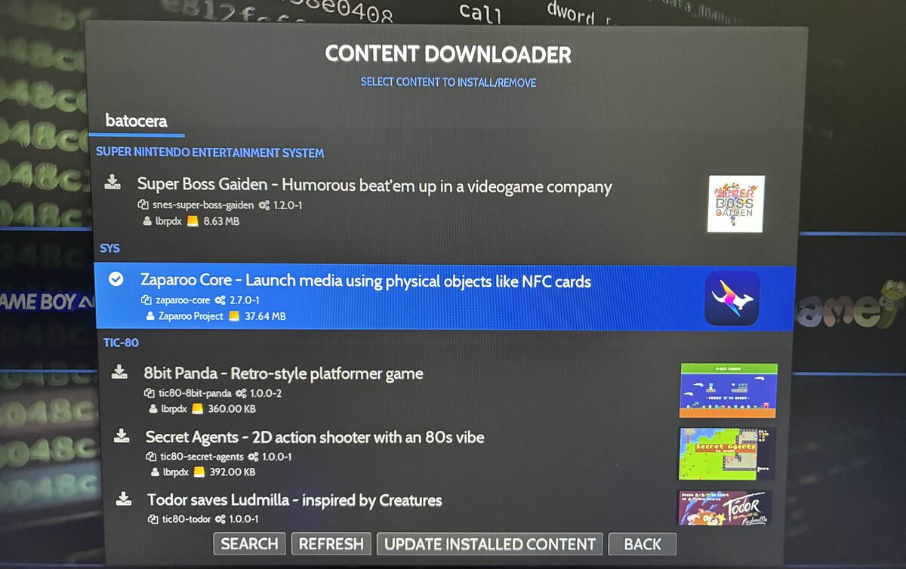

Zaparoo Core is now available directly in the Batocera Content Downloader! This makes it easier than ever to get Zaparoo running on your Batocera system.

{/* truncate */}

Instead of manually downloading and installing the Zaparoo Core package, you can now find it right in the Content Downloader under the "SYS" section.

Check out the [Batocera installation guide](/docs/platforms/batocera) for more details on getting started. A huge thank you to Lbrpdx of the Batocera team for helping make this happen!
