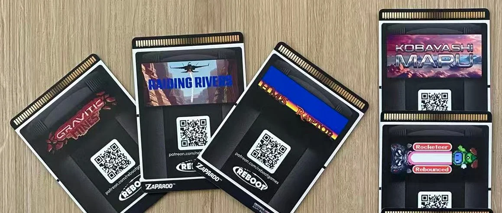

Hey! I've been quietly working on something for ages now and I think it's ready for people to try out. Zaparoo can now distribute games. Not launch ROMs you already have on your SD card, but actually download and install new games over the internet. You tap a card and the game appears on your device and launches. That's it.

{/* truncate */}

## Reboot Games

The first release is a set of 10 Atari Jaguar homebrew titles from [Reboot Games](http://reboot-games.com/). CJ at Reboot Games was kind enough to be the guinea pig for this whole idea, so a huge thank you to him for that.

There's five free games and five playable demos:

- [Biopede](https://www.reboot-games.com/rebootnews/biopede/) (free)
- [Downfall](https://www.reboot-games.com/rebootnews/downfall/) (free)
- [HMS Raptor](https://www.reboot-games.com/rebootnews/hms-raptor/) (free)
- [Raiding Rivers](https://www.patreon.com/posts/raiding-rivers-94971513) (free)
- [Superfly DX](https://www.reboot-games.com/rebootnews/superfly-dx/) (free)
- [Full Circle: Rocketeer](https://www.reboot-games.com/rebootnews/full-circle-rocketeer-promo/) (demo)
- [Gravitic Mines](https://www.reboot-games.com/rebootnews/gravitic-mines-demo/) (demo)
- [Kobayashi Maru: Final](https://www.reboot-games.com/rebootnews/kobayashi-maru-final-promo/) (demo)
- [Last Strike](https://forums.atariage.com/topic/343051-last-strike-demo-rom/) (demo)
- [Rocketeer: Rebounced](https://www.patreon.com/rebootgames/shop/rocketeer-rebounced-1451373) (demo)

## How to try it

You'll need a MiSTer with Zaparoo Core v2.9.1 (current latest) or above, and the latest unstable Atari Jaguar core either from the MiSTer Discord or here: [Single SDRAM](https://cdn.zaparoo.com/files/Jaguar_ReworkSingle_20251215.rbf) | [Dual SDRAM](https://cdn.zaparoo.com/files/Jaguar_ReworkDual_20251215.rbf)

Head to the [Reboot Games deck page](https://zpr.au/d$50bdtraq) on Zaparoo Online. From there you can pick any of the 10 games and write them to a blank NFC card using the Zaparoo App (or you can just write the link manually to a card). Tap it on your reader and the game should download and launch.

This is all very new, so there will be rough edges. I'm looking for people to try it and tell me what works and what doesn't. If you hit a bug, or something is confusing, or it just doesn't work, please let me know. That's exactly the kind of feedback I need right now and why I'm making a post here.

## What is Zaparoo Online?

Some of you may have noticed [Zaparoo Online](https://online.zaparoo.com) already. It's a service adjacent to the project that I've been messing with off and on for a while now, and have recently been dusting off a bit more. It's basically working as backend infrastructure for features that need an internet connection to work. You don't need to sign up to make this feature work but you're welcome to take a look.

For anyone worried as well, I'm going to be working on Zaparoo Online more often, but it will never be a hard requirement or lock anything out of Zaparoo Core. In fact all the mechanisms that make this game install thing work have already existed and been documented ([here](/docs/zapscript/launch/#remote-install) and [here](/docs/zapscript/syntax/#zap-links)) for the better part of a year. Online is the glue to make those features work well together and that will be the running theme for the service.

## Physical cards

There is another part to this as well, some real cards! I've listed on the shop a pre-printed set of cards already written with the correct data. These are literally pull them out the pack, tap and play. The first time I've been able to legally sell cards with art on them!! Check it out here: [Reboot Games Demo Booster Vol. 1](https://shop.zaparoo.com/products/reboot-games-demo-booster-vol-1) (and as always a huge thank you to [Tim Wilsie](https://timwilsie.art/) who I managed to squeeze one more bit out of and am eternally grateful, the cards look dope)

This is a limited run at much higher price than the real thing (for a pack of free games anyway) but I wanted to be able to show off the whole concept together. What if you could buy a card for a real game and it just ran the game like real physical media?

## Looking for Game Devs

Here's the other thing I wanted to talk about. I want to find developers who are interested in distributing their games through Zaparoo. I really don't care about the scale. If you're making retro homebrew and want a way to get your games on MiSTer (or other platforms down the road, I'd love to get this working on every Zaparoo Core platform), I want to hear from you.

I can do printed NFC cards with your game art, digital distribution through Zaparoo Online, or both. I'm open to working it out with you.

If that sounds interesting, have a look at the [Publish page](https://zaparoo.com/publish) on zaparoo.com or reach out at [partnerships@zaparoo.com](mailto:partnerships@zaparoo.com).

---

This has been over a year in the making and I'm really curious to hear what people think. Come chat about it in the [Discord](https://zaparoo.org/discord) if you give it a go.
