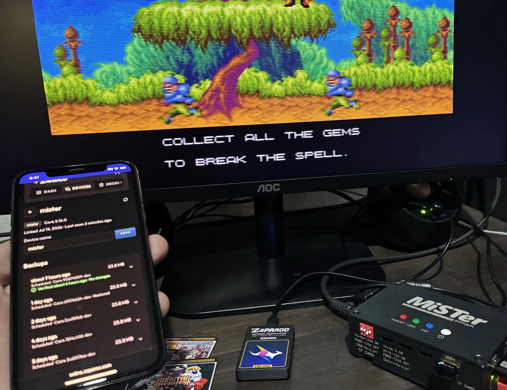
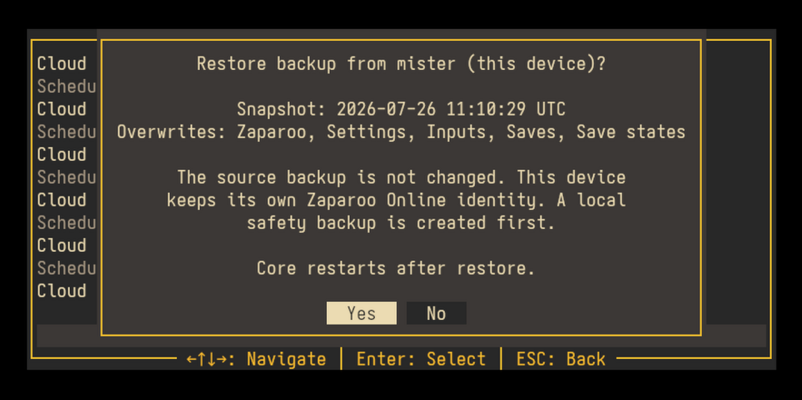
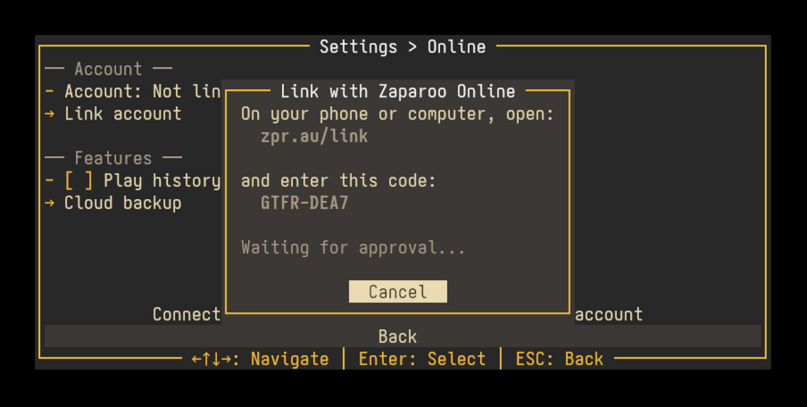
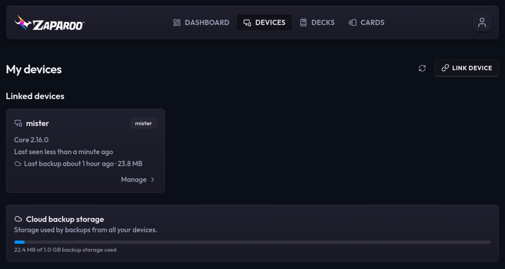
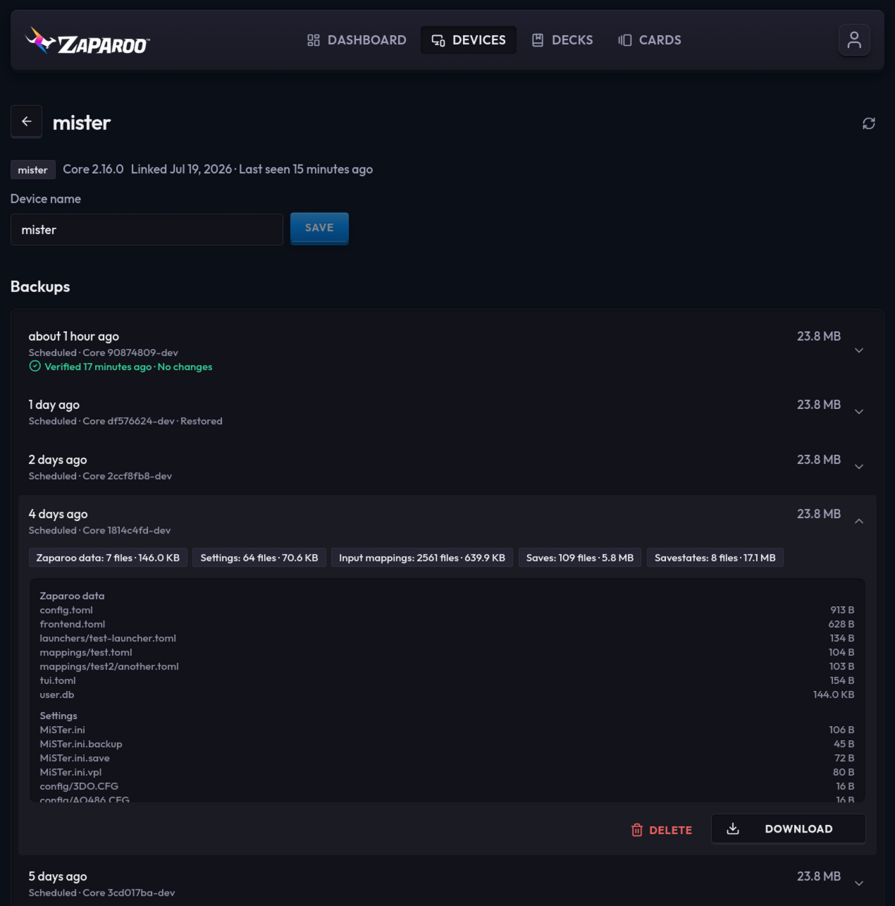
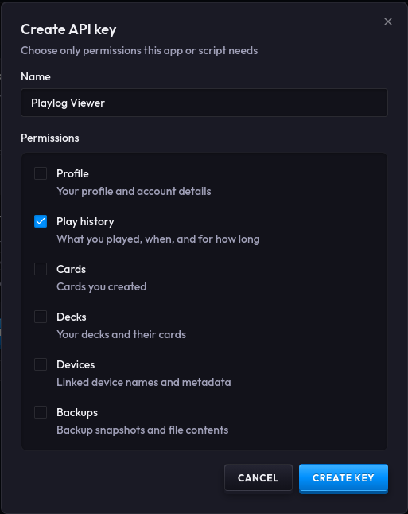
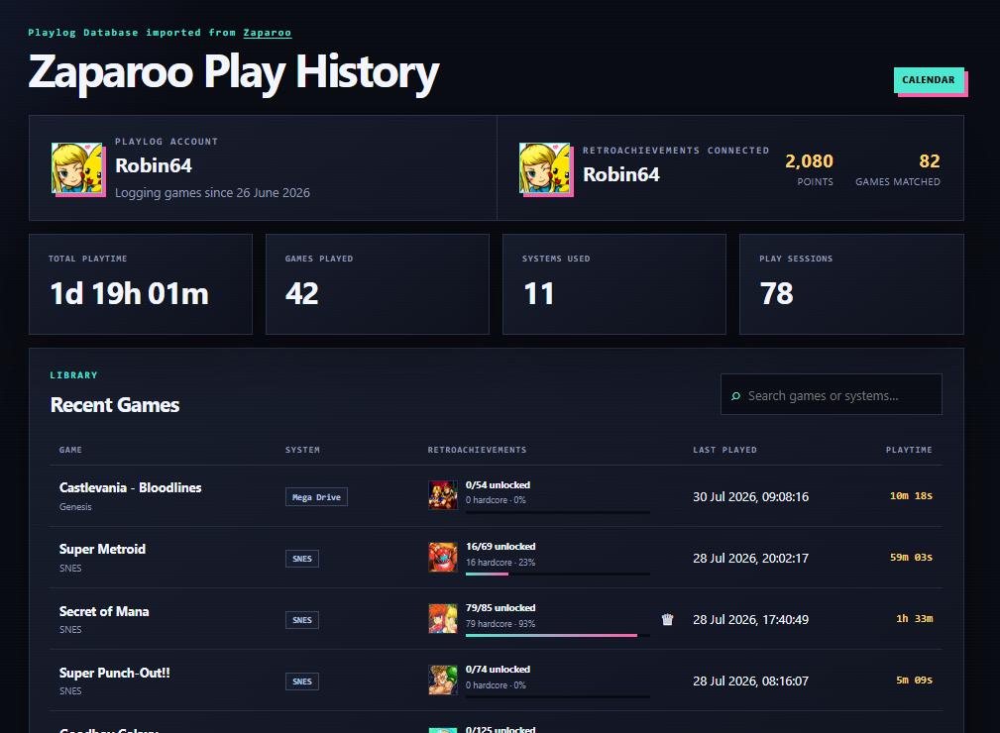

Hi everyone. I want to talk about Zaparoo Online properly for the first time.

Zaparoo Online isn't new. I've been poking at it on and off for a while now, adding things like online cards, decks and game distribution as I found places where an internet service could help. There were some cool ideas in there, but if you asked me exactly what Online was supposed to become, I don't think I had a very good answer.

I think I do now.

The first part is automatic device backups. The second is a new User API that lets you give apps access to your own Zaparoo data. They solve different problems, but together they finally gave Online a clear job: protect your setup off-site and let apps you choose do more with your Zaparoo data, without making normal Core use depend on an account.

{/* truncate */}

## The backup I always wanted on MiSTer

Device backups probably sound like they came out of nowhere. Zaparoo is supposed to launch games when you tap things. Why is it backing up an entire MiSTer now?

The honest answer is that I've wanted this for myself for years. I always have this little fear in the back of my head that my MiSTer SD card is going to die, or I'm going to delete the wrong folder, and all my save files and save states will disappear with it. It has genuinely made me avoid starting games before. I don't want to put 30 hours into something while wondering whether the only copy of that save is sitting on one SD card.

There are already good ways to back up MiSTer. You can copy files to another drive, sync them to a NAS or install one of the scripts people have made for it. They all need some amount of setup and maintenance though. What I wanted was the completely turnkey version: link my MiSTer, pick a schedule and get back to playing games.

So I built it.

[Zaparoo device backups](/docs/features/backups/) collect the data that makes your setup yours. Cloud backups currently work only on MiSTer. I plan to expand them to other Zaparoo platforms, but that isn't ready yet. A MiSTer backup includes Core configuration, favorites, play history, token mappings, profiles, custom launchers and the user database, along with MiSTer settings, input mappings, save files and save states, including the separate saves created by device profiles.

It does **not** back up ROMs, disc images, downloaded cores or scraped artwork. This isn't a full SD card clone or a save-sync service. It creates point-in-time snapshots you deliberately restore, and it will not try to keep live saves synchronized across devices. Save syncing is a separate problem with plenty of existing solutions.

You can run a backup manually or let Core do it daily or weekly. Online keeps the latest 30 changed snapshots for each linked device, and Core holds back backup work while a game is running so it doesn't compete with what you're playing.

A backup is only useful if you can actually restore it. If an SD card dies, set up Zaparoo on the replacement MiSTer, link it to the same account and restore a snapshot from the old device. You can also use this to copy a preferred setup onto another MiSTer while each one keeps its own device identity.

## Cloud backups and Warp

Cloud backups are part of [Warp](https://zaparoo.com/pricing), the paid tier of Zaparoo Online. It costs US$3.99 per month or US$29.99 per year, and also includes Zaparoo App Pro while the subscription is active. Existing Patreon Supporter and Sponsor members already have Warp access, so you don't need another subscription; link your Patreon account to Online and it will show up.

I want to be direct about why this is paid. There are storage and infrastructure bills involved, but the bigger reason is that recurring income lets me spend more time working on Zaparoo. It funds the hosted service and continued work on the free, open-source software around it. I'm charging for the maintained online convenience here, not taking local Core features away and selling them back.

I previously used higher card and deck limits as a Warp benefit. That never became a useful reason to subscribe, so I've removed those restrictions. Everyone can now create effectively as many cards and decks as they could reasonably need, with only very high abuse-prevention limits in the background. I'd rather Warp pay for features with real ongoing value than keep arbitrary limits around because they used to be part of the plan.

<Button
  icon={<FAIcon icon="link" />}
  label="Start Warp"
  link="https://zaparoo.com/pricing"
  variant="primary"
  dataUmamiEvent="online-announcement-warp-cta"
/>

## Yes, you can keep doing this locally

I know what the first question is going to be: how do I self-host it?

Zaparoo Online itself is not self-hostable, and I am not going to release a self-hosted version of the service. That's the straight answer. Online costs money to build and run, and I need it to become a sustainable product if I'm going to keep putting this much time into Zaparoo.

That does **not** mean the underlying backup feature is locked to my service. Zaparoo Core remains local-first and open source. It can create portable backup files without an Online account, and the same backup can be [triggered from the command line](/docs/core/cli/#back-up-and-restore-device-data). If you want to schedule that yourself and copy the result to a NAS, another cloud provider or a drive you keep somewhere else, you can.

Core's cloud-backup endpoint can also be changed in configuration without forking anything. There isn't a supported drop-in server for it today, and I haven't published the server API yet because the protocol is still new and I need room to make breaking changes while it settles. Once it does, I will publish a stable, documented API on Zaparoo.org. This is the same approach I took with [Zap Links](/docs/zapscript/syntax/#zap-links), where the protocol and a working self-hosted example are already documented.

I will not reject a sound local or third-party implementation because it overlaps something paid in Online. If someone finds an artificial dependency on Online, I consider that a design problem, not protection for the hosted service.

## Setting it up

You need Zaparoo Core v2.16.0 or newer. On MiSTer, update Zaparoo through Update All, then open **Scripts > zaparoo** and go to **Settings > Online**.

Core will show a URL and one-time code. Open the URL on your phone or computer, sign in (or create an account), enter the code and the MiSTer will appear under your Online devices. From there, enable cloud backups and choose a daily or weekly schedule. You can also run the first backup manually, which is a good way to confirm everything is working before leaving the schedule to take over.

The result appears on the MiSTer and in Zaparoo Online. Core records immediate backup problems in its Inbox, which you can currently view with the Zaparoo App. Online also emails you when backup storage is nearly full or a linked device that is still online appears to have stopped backing up.

## What gets uploaded

Linking a device does not upload anything by itself. Cloud backups and play-history sync are separate options, and both start disabled. Normal Zaparoo Core use does not require an Online account.

Backups are encrypted on the way to Online and while they're stored, but they are not end-to-end encrypted. That means I can technically access them. I don't go looking through people's backups, but access may sometimes be needed for support you ask for, security problems, abuse or legal requests. I'd rather say that plainly than hide it in the privacy policy.

Core specifically excludes credentials and authentication files before upload. It also excludes the games themselves. Save files and configuration are still personal data though, even if they aren't passwords, and I treat them that way. Backups are private, access-controlled and mirrored to a second storage provider for disaster recovery. They aren't used for advertising, profiling or AI training.

You can delete individual snapshots whenever you want. Ending Warp stops new cloud backups but does not lock you out of snapshots you've already made: you can still view, download and restore them.

You can also erase synced play history, download a copy of the data in your account or delete the account entirely. Erasing play history leaves local history alone, and Core won't upload those deleted sessions again. Backup archives are downloaded separately because they can be much larger than the rest of the export. The full details are in the [Zaparoo privacy policy](https://zaparoo.com/privacy).

## A free API for your own data

The other new feature is the [Zaparoo Online User API](https://developers.zaparoo.com/). This is a stable production v1 API: existing endpoints and fields will not receive breaking changes, and new work will be additive.

The API itself is free and will remain free. I think it's only fair that you can access your own data. A paid feature might control whether new data gets created—Warp is required to make new cloud backups, for example—but it won't cost anything to read data already in your account. Play-history sync is also free.

Right now you create an API key from your Online account and choose exactly what it can read. Permissions are split between profile details, play history, cards, decks, linked devices and backups. There are no write permissions in v1. Keys are shown once, can be revoked immediately and should only be given to apps you trust. The Backups permission includes access to files inside your snapshots, so be especially careful with that one.

The most obvious uses right now are play-history dashboards, now-playing integrations and things like Discord status. The API can return individual play sessions, summaries and whether a game is currently running. I'm sure there are better ideas I haven't thought of yet, which is a big part of why I'm releasing it and asking developers to try it.

A great early example is Robin64's [MiSTer Playlog Viewer](https://www.robin64.co.uk/playlogviewer/), which turns play history into recent activity, game statistics, calendars, RetroAchievements progress and shareable profiles. Robin64 has already built Zaparoo User API support and plans to release it soon. You can read more about how the project came together in [Robin64's development write-up](https://www.robin64.co.uk/blog/mister-playlog.html).

If people find the API useful, I'd also like to add OAuth later so third-party apps can ask for access with a normal approval screen. Manually created API keys aren't going anywhere, but OAuth would make consumer-facing integrations much nicer. That's a later job though. The API available today is deliberately read-only and starts with a stable set of useful data.

## Where Online fits

Zaparoo Online has been a collection of experiments for a long time. These releases finally make it feel like those experiments are going somewhere.

I want it to handle the parts of Zaparoo that genuinely work better with an online service: protecting devices off-site, connecting your data to apps you choose, helping multiple devices work together and, later on, making it easier to manage and discover games across a collection. There are bigger ideas around remote device management and shared playlists, but I'm not going to pretend all of that is ready today.

What I can commit to is the boundary around it. An Online account will not become required for normal Core use. Linking will not silently upload backups, play history or library data. Online will not upload your ROM or disc-image contents. User data will not be sold or used for advertising. Backups, synced play history and private account data will not be used to train recommendation or AI models. Local and third-party alternatives remain welcome.

For now, I'm starting with something I personally wanted badly enough to build: less worrying about my MiSTer saves, plus a way for other developers to do more interesting things with Zaparoo data.

Update to [Zaparoo Core v2.16.0](/blog/core-v2.16.0), take a look at the [device backup guide](/docs/features/backups/) and let me know how it goes. If you're building something with the User API, I especially want to hear from you. Come and talk to us on [Discord](https://zaparoo.org/discord).

<Button
  icon={<FAIcon icon="link" />}
  label="Start Warp"
  link="https://zaparoo.com/pricing"
  variant="primary"
  dataUmamiEvent="online-announcement-cta"
/>
