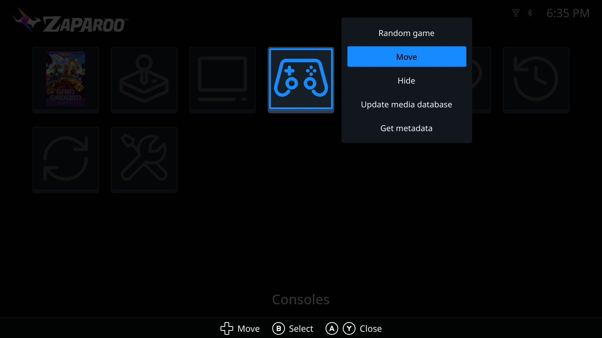
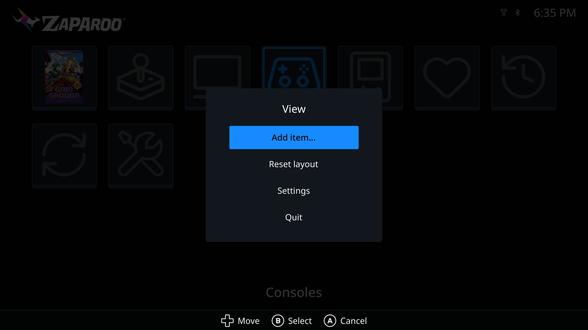
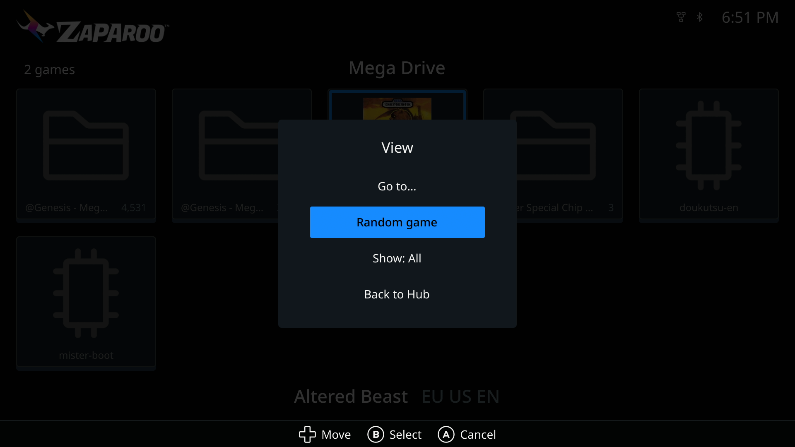
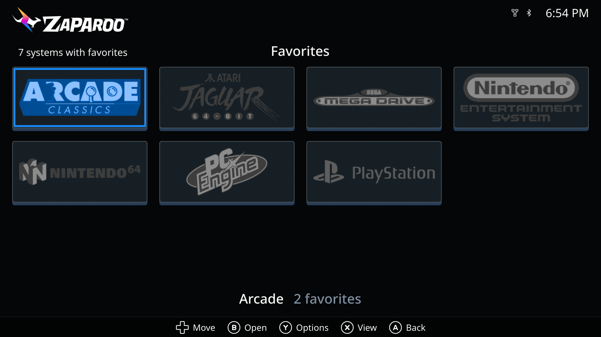
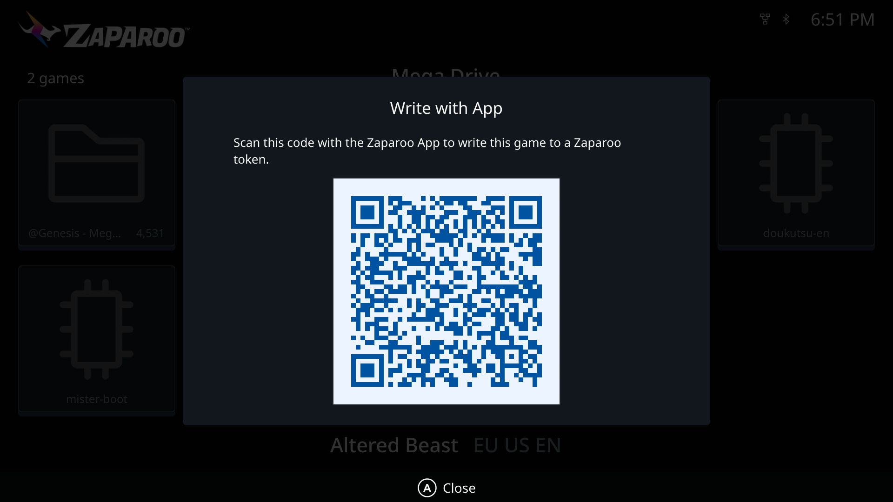
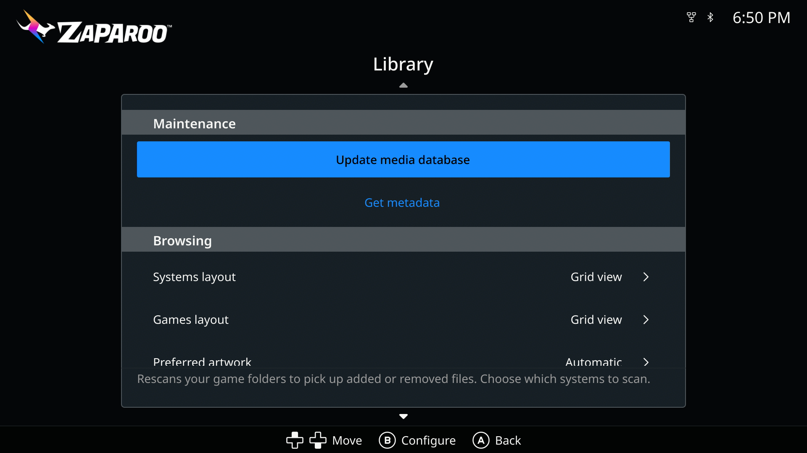
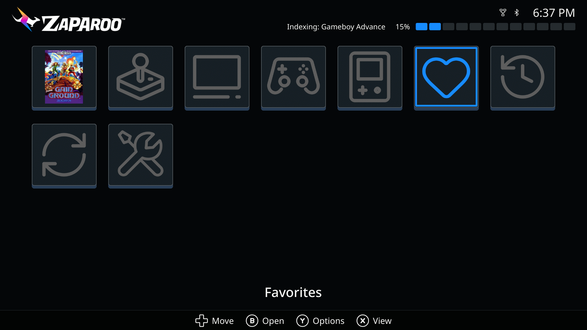
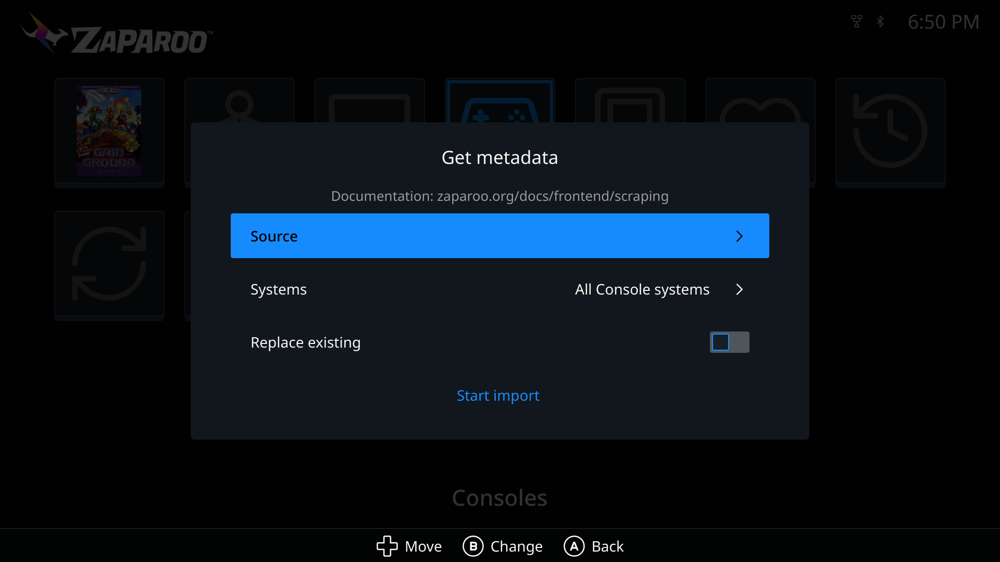

import Gallery from "@site/src/components/Gallery";
import hubDarkImage from "./hub_zaparoo_dark.png";
import hubLightImage from "./hub_zaparoo_light.png";
import hubGameBoyImage from "./hub_game_boy.png";
import gamesGridImage from "./games_grid.png";

[Zaparoo Frontend](/docs/frontend/) v1.3.0 and [Zaparoo Core](/docs/core/) v2.17.0 are the next paired Zaparoo releases.

Frontend is a lot faster and has a new look, plus a Hub you can arrange yourself and a reorganized settings menu. Core checks for updates on its own, supports far more emulators on Linux desktops and handhelds, tightens remote access, and adds remote control for third-party apps. Linux desktop and SteamOS leave beta with this release.

Thank you to [Giancarlo Erra](https://github.com/giancarloerra) for Frontend's paging, random picks, favorites controls, and performance work, [Peter Brittain](https://github.com/KindarConrath) for grouping favorites by system, [theypsilon](https://github.com/theypsilon) for the updater improvements, and [Wilfried Jeanniard](https://github.com/willoucom) for the French translation.

{/* truncate */}

<Gallery captions={false} media={[
  { src: hubDarkImage, width: 1920, height: 1080, alt: "Zaparoo Frontend Hub in the Zaparoo Dark color scheme" },
  { src: hubLightImage, width: 1920, height: 1080, alt: "Zaparoo Frontend Hub in the Zaparoo Light color scheme" },
  { src: hubGameBoyImage, width: 1920, height: 1080, alt: "Zaparoo Frontend Hub in the Game Boy color scheme" },
  { src: gamesGridImage, width: 1920, height: 1080, alt: "Zaparoo Frontend games grid with box art" },
]} />

**Frontend highlights:**

- **[Much faster](#much-faster)**: quicker startup, browsing, paging, cover loading, and launching
- **[New look](#new-look)**: a rebuilt theme, 19 color schemes, new controller glyphs, redrawn menus and dialogs
- **[Arrange the Hub](#arrange-the-hub)**: add systems, folders, and games as tiles, then move, hide, or delete them
- **[Redesigned settings](#settings)**: Appearance, Library, Display, Controls, Language, and About, with a description on every row
- **[Get metadata](#get-metadata)**: a clearer import dialog and a per-game entry
- **[Per-game launchers and random picks](#frontend-launching)**: change the launcher for one game, or pick a random game or favorite
- **[French translation](#languages)**: plus translated category names
- **[MiSTer](#frontend-mister)**: battery indicator, output-aware resolution, first-frame covers, an updated built-in updater, and CRT settings from the MiSTer OSD

**Core highlights:**

- **[Update checks](#core-updates)**: Core checks for signed releases and can install them in place, with rollback
- **[27 Linux emulator launchers](#standalone-emulator-launchers)**: plus EmuDeck and RetroDECK on desktop Linux, Bazzite, and ChimeraOS
- **[Bottles, Faugus, and Moonlight](#bottles-faugus-and-moonlight)**: launch Windows programs, Faugus games, and streamed apps
- **[Encryption by default](#encryption-on-by-default)** on Linux and SteamOS, and a stricter [API access model](#who-can-use-the-api)
- **[Remote control](#remote-control-through-the-user-api)**: let apps you authorize launch games from anywhere
- **[Alternate cores from ZapScript](#boot-an-alternate-core)**: `launch.system?launcher=`
- **[Disc token files](#disc-token-files)**: burn ZapScript into a `zaparoo.txt` file on a data disc
- **[Patch tags](#patch-tags)** for ROM hacks
- **[SteamOS installer](#installer-and-zaparoo-runtime)**: Decky plugin offer, temporary admin password, Zaparoo Runtime commands

## Download

### Frontend

<Button
  icon={<FAIcon icon="download" />}
  label="Download Frontend v1.3.0"
  link="https://github.com/ZaparooProject/zaparoo-frontend/releases/tag/v1.3.0"
  variant="primary"
/>

<Button
  icon={<FAIcon icon="link" />}
  label="Install Guide"
  link="/docs/frontend/setup/"
  variant="primary"
/>

<Button
  icon={<FAIcon icon="fa-brands fa-github" />}
  label="Frontend GitHub"
  link="https://github.com/ZaparooProject/zaparoo-frontend/"
  variant="primary"
/>

The release is live through MiSTer **Update All**, on GitHub Releases, and through Frontend's built-in updater.

### Core

<Button
  icon={<FAIcon icon="download" />}
  label="Download Core v2.17.0"
  link="https://zaparoo.org/downloads#zaparoo-core"
  variant="primary"
/>

<Button
  icon={<FAIcon icon="fa-brands fa-github" />}
  label="Core GitHub"
  link="https://github.com/ZaparooProject/zaparoo-core/"
  variant="primary"
/>

## Before you update

- **Frontend needs Core v2.17.0.** Update All installs both together, so this only matters if you install Frontend by hand. Older Core still connects with a warning, but library actions expect the new API.
- **Frontend now renders at up to 720p by default.** On a 1080p display the interface runs at 960 by 540, and on 1440p at 1280 by 720, integer-scaled to your output. If you want full 1080p, pick it under **Settings > Display > Interface resolution**; that mode runs with animations off. This prepares for a rendering change in the next release.
- **Frontend settings migrate once.** Browsing layout is now separate Systems and Games layouts, Button style resets to Automatic, Re-scrape existing moved into the Get metadata dialog as Replace existing, the alternate-versions setting is gone (always on for Arcade), and hidden categories become Hub tiles you can restore with **Add item...**.
- **Encryption is on by default on Linux and SteamOS.** New and migrated configurations require clients to pair.
- **Third-party API clients must pair or use an API key** on every platform except MiSTer, MiSTeX, Batocera, LibreELEC, and RePlayOS.
- **Public Zap Links need HTTPS.** Plain HTTP only works for localhost and private addresses.
- **Run a media database update** if you use Arcade Organizer on MiSTer or have ROM hacks in your library.

## Find changes for your setup

- **Every Core platform:** [updates](#core-updates), [security and remote access](#core-security-and-remote-access), [readers and ZapScript](#core-readers-and-zapscript), [library and backups](#core-library-and-backups), [other changes](#other-changes)
- **MiSTer:** [Frontend](#frontend-speed-and-style), [MiSTer changes](#core-mister)
- **SteamOS:** [SteamOS](#core-steamos), [Linux launchers](#core-linux-desktop-bazzite-and-chimeraos)
- **Linux:** [Linux launchers](#core-linux-desktop-bazzite-and-chimeraos), [encryption by default](#encryption-on-by-default)
- **Bazzite and ChimeraOS:** [Linux launchers](#core-linux-desktop-bazzite-and-chimeraos)
- **Windows:** [Windows](#windows)
- **Batocera:** [Batocera](#batocera)

## Frontend: Speed and style

### Much faster

Frontend and Core were optimized together:

- Opening a system goes straight to its games, and Core now tells Frontend up front which games have covers, so it stops asking for images that do not exist.
- Long lists scroll and page more smoothly, and cover art is cached more sensibly.
- System logos and icons no longer pop in, and Hub covers are on screen from the first frame after boot.
- Returning to a page deep in a big list no longer freezes the interface, and launching responds a frame after you press the button.

Thanks to [Giancarlo Erra](https://github.com/giancarloerra) for a large share of this work.

### New look

- The theme was rebuilt around three colors per preset, and there are 19 presets under **Settings > Appearance**: Zaparoo Dark and Light, Classic Purple, Amber and Green Phosphor, Game Boy, Neo Geo, NES, Virtual Boy, Dracula, Everforest, Gruvbox, Nord, Oxocarbon, Rosé Pine, Solarized Dark and Light, Synthwave '84, and Flexoki Paper.
- The circuit-board background is gone, the Zaparoo logo is rendered at the right size for each screen and scheme, and status icons follow the theme so light schemes work.
- New controller glyphs (Kenney's CC0 set) with a fifth style, one selection style across menus, pickers, and settings, dialogs that size to their content, and a redesigned game details dialog.
- Numbers use your locale's digit grouping.

## Frontend: Hub and browsing

### Arrange the Hub

The Hub is now a grid you lay out yourself. Tiles can be categories, the built-in Resume, Favorites, Recently played, Update, and Settings actions, systems, folders, or games.

- **Add to Hub** from the options menu of any system, folder, game, favorite, or recent item, or **Add item...** from the Hub's View menu.
- Each tile's options menu offers **Move**, plus **Hide** for categories and actions or **Delete** for tiles you added. **Reset layout** puts everything back.
- Tiles that cannot run stay put with a reason, such as **No recent games**, instead of disappearing, and Resume names the game it will resume.
- The Hub keeps your place across a MiSTer relaunch, and B no longer quits Frontend from the Hub. Quit moved into the View menu.

The layout is saved under `[[hub.items]]` in `frontend.toml`; see [configuration file](/docs/frontend/customization/#configuration-file).

### Browsing

- Systems stored on more than one drive show the root beside duplicate names, and folders show an item count.
- The letter jump works at a system's root, and Left and Right page a whole screen in list layout.
- The page position moved into the top status strip on every theme except CRT.
- Box art that failed to load during a NAS mount race recovers once the system finishes indexing.

### Favorites and recents

- Group favorites by system through a new Favorite Systems screen, contributed by [Peter Brittain](https://github.com/KindarConrath).
- Sort favorites by default order or A to Z, and filter the games list to favorites only.
- **Random favorite** picks from your favorites.
- Recently played and Favorites now page past the first screen.

## Frontend: Launching

- **Change launcher** works on a single game, not just a system, and shows the current choice inline.
- **Random game** picks from the current system through Core's `launch.random`.
- **Write with phone** is now **Write with App**, with a clearer prompt to scan the code with the Zaparoo App.
- **Launch core** is now **Launch system**.
- Alternate arcade versions are always discovered for Arcade games; the setting is gone.
- A Hub shortcut to a launch-only system launches it instead of opening an empty list.

## Frontend: Settings and library

### Settings

Settings are now Appearance, Library, Display, Controls, Language, and About, and every row has a description.

- **Library** puts **Update media database** and **Get metadata** at the top, each with a dialog to choose systems, and splits the browsing layout into Systems and Games layouts.
- **Controls** detects your controller for button icons, adds a fifth icon style, and can swap confirm with cancel or Options with View.
- **Display** offers exact divisors of your current output as **Interface resolution** (see [Before you update](#before-you-update) for the new default), resets a refused mode to Automatic, and re-detects the output while running.
- The first-run scan no longer blocks the interface. Indexing starts in the background while the Hub shows what is happening.

### Status line and error messages

A status line under the header replaces the status pill: connection state, the running task with a progress track, and short-lived messages such as playtime warnings. Failures open a dialog that names the action, such as **Launch failed**, with **Retry** and **OK**.

### Get metadata

The metadata action is now called **Get metadata** everywhere: the Library row, the system and category menus, and new entries on individual games, favorites, and recents.

- The dialog asks for a **Source**, the **Systems** to cover, whether to **Replace existing**, then **Start import**, and reminds you that Zaparoo imports artwork from files you already have rather than downloading it.
- Starting from a system or category menu opens the same dialog, pre-scoped, instead of silently running the gamelist scraper with default options.
- **Settings > About** gains a **Documentation** row with a QR code for the Frontend guide.
- The Hub explains itself during the first scan (**Updating the media database**, then **No games found yet** if nothing turns up).

### Languages

French joins the interface languages, translated by [Wilfried Jeanniard](https://github.com/willoucom). Category names from Core are now translated too, the language list is sorted, and the **System names** setting is now called **Region**.

## Frontend: MiSTer

- Builds with a supported battery board show a battery icon and percentage in the header.
- On a 1080p output, Frontend renders an integer-scaled 960 by 540 scene resolved from the actual output.
- `--crt` no longer queues a restart on every launch.
- `frontend.toml` is edited in place, keeping your comments, and the write is skipped when nothing changed.
- The built-in updater is at version 1.0.1, with smoother progress and cleaner cancellation, thanks to [theypsilon](https://github.com/theypsilon).

### MiSTer Main changes

Frontend ships with Zaparoo's build of MiSTer Main, and that build has moved on since the last Frontend release:

- **CRT settings in the OSD.** System Settings has a **Frontend** page with CRT mode, the NTSC or PAL video standard, and a Screen position adjuster that moves the picture live against a test pattern. It works even when Frontend is not running, so you can turn CRT mode on without an HDMI display.
- **The first button press after boot is instant.** Main loads controller mappings at startup instead of on the first press, which used to take about a third of a second.
- **Keyboard support.** Keyboards now reach Frontend, not only controllers, and Main reports the active controller so Frontend's button prompts match it. Menu and F12 still open the OSD.
- **Frontend stays up.** Main restarts Frontend if it crashes, cleans up stale copies, waits for the HDMI mode to settle before starting it, and keeps its framebuffer settings, fixing wrong-size or black starts.
- **Fixed:** launching a core from Frontend could hard-freeze the MiSTer on some cores, such as Atari 800 and 5200.
- **Fixed:** the OSD and menu stay out of the way while Core runs a script or ARM app on the console.

## Core: Updates

### Automatic update checks

**Applies to:** All Core platforms.

Core checks for new releases about every 12 hours and posts an Inbox message when one exists. Installs owned by Update All or the Batocera package manager get the notice too, pointed at that tool. See [Core updates](/docs/core/updates/).

### Opt-in automatic installs

**Applies to:** All Core platforms that update in place.

Set `install = true` under `[updates]` and Core installs new releases by itself:

- It stages the download, runs the new build once, backs up the user database, swaps the binary, and restarts, rolling back if the new build fails within 30 seconds.
- Installs wait for a quiet minute and refuse to run during indexing, scraping, backups, tag writes, or on a low battery. A manual `update.apply` can force past a running game.
- Windows updates in place too, as do Batocera installs that did not come from the package manager.

2.17.0 itself is installed the usual way for your platform; updates after that can arrive automatically.

## Core: Security and remote access

### Encryption on by default

**Applies to:** Linux and SteamOS.

New Linux and SteamOS configurations require remote clients to pair. The App, the Web UI from another device, and any tool on another computer ask for the six-digit PIN once.

### Who can use the API

**Applies to:** All Core platforms.

Unpaired remote clients now only get the older compatibility access on MiSTer, MiSTeX, Batocera, LibreELEC, and RePlayOS. Everywhere else a remote client must pair or send an API key, for WebSocket, HTTP, and event streams alike. Paired members can now send input and take screenshots, and installing updates needs its own capability. The [permissions](/docs/core/api/#permissions) section of the API reference has the full table.

### Remote control through the User API

**Applies to:** All Core platforms, with a linked Zaparoo Online account.

Turn on **Remote control** under **Settings > Online** in the terminal UI, and apps you authorize through the [User API](/docs/online/#user-api) can launch a game or system, stop playback, search your library, or run a MiSTer script on that device. It is off by default, every command is logged on the device, and free accounts can control one device at a time (Warp subscribers are not limited). For now it is only available through the User API, for third-party apps. See [remote control](/docs/online/#remote-control).

## Core: Linux desktop, Bazzite, and ChimeraOS

### Standalone emulator launchers

**Applies to:** Linux, Bazzite, ChimeraOS, and SteamOS.

Core registers launchers for 27 standalone emulators it finds installed, whether native, in `~/.local/bin`, as an AppImage in `~/Applications`, or as a Flatpak. A missing emulator is not listed; install it and reload Core to add it.

Emulators

Xenia Canary (Xbox 360), Ryubing (Switch), shadPS4 (PS4), PCSX2 (PS2), Cemu (Wii U), Azahar (3DS), Vita3K (Vita), RPCS3 (PS3), DuckStation (PlayStation), PPSSPP (PSP), Dolphin (GameCube and Wii), melonDS (DS), ScummVM, Supermodel (Model 3), xemu (Xbox), MAME (Arcade), Flycast (Dreamcast, NAOMI, and Atomiswave), RMG (Nintendo 64), mGBA (Game Boy, Game Boy Color, and GBA), Ruffle (Flash), and PrimeHack (GameCube and Wii).

Launcher IDs, file types, and scanned folders are on the [Linux launchers](/docs/platforms/linux/launchers/#standalone-emulators) page, and `launchers.preference` accepts the `Native`, `EmuDeck`, and `RetroDECK` groups on all four platforms.

### EmuDeck and RetroDECK on desktop Linux

**Applies to:** Linux, Bazzite, and ChimeraOS.

The EmuDeck and RetroDECK integrations from SteamOS now work on desktop Linux, Bazzite, and ChimeraOS. Both follow a moved ROM directory, EmuDeck from its `settings.sh` and RetroDECK from its `retrodeck.json`, and both read ES-DE gamelists for names.

### Bottles, Faugus, and Moonlight

**Applies to:** Linux, Bazzite, ChimeraOS, and SteamOS.

- [Bottles](/docs/platforms/linux/launchers/#bottles) programs are listed through `bottles-cli` and launched in their bottle.
- [Faugus Launcher](/docs/platforms/linux/launchers/#faugus) games are read from its library and launched by ID.
- [Moonlight](/docs/platforms/linux/launchers/#moonlight) streams an app from a paired host described in a small `.moonlight` file, so a token can start a game running on another PC.

### RetroArch and ES-DE

**Applies to:** Linux, Bazzite, and ChimeraOS.

RetroArch launchers are registered only when the Flatpak is installed, and ES-DE gamelists now provide names and metadata for games indexed from your `index_root` folders. Flatpak launches stop when Core stops them.

## Core: SteamOS

### Installer and Zaparoo Runtime

**Applies to:** SteamOS.

- The installer runs as a transaction: it backs up the current binary, installs, checks Core's API and version, and rolls back on failure.
- It offers to install the [Decky Loader plugin](/docs/platforms/steamos/decky/) when Decky Loader is present.
- On a Steam Deck with no admin password, it offers to set the temporary password `Zaparoo!` for the steps that need it and removes it afterwards.
- `install.sh` gains `status`, `repair`, and `uninstall` modes, `--channel beta`, `--dry-run`, and signed checksum verification for every download.
- Zaparoo Runtime can be managed from Core's command line with `-install steam-runtime`, `-uninstall steam-runtime`, and `-steam-runtime-status`, and it no longer reports itself as the active game.

## Core: MiSTer

### Boot an alternate core

**Applies to:** MiSTer.

`launch.system` accepts a `launcher` argument, so a token can boot an alternate core with nothing loaded: `**launch.system:Nintendo64?launcher=80MHzNintendo64`. Launcher IDs match case-insensitively, and Core reports a clear error if the launcher belongs to another system or its core is not installed. See [launch.system](/docs/zapscript/launch/#launchsystem). The `launchers` API also reports the installed RBF behind each MiSTer launcher.

### Arcade identity and Organizer

**Applies to:** MiSTer and MiSTeX.

Core skips the `_Arcade/_Organized` folders that Arcade Organizer creates, so every arcade game is indexed once from its `.mra`. Games started from the MiSTer menu are recorded under that same identity, and play history recorded under a bare set name by earlier versions is repaired once. Run a media database update to drop old duplicates.

### Artwork and manuals from Update All

**Applies to:** MiSTer.

A new `mister-docs` scraper imports box art, year, genre, developer, player count, descriptions, and manuals from the packs Update All installs under `docs/<system>`. The Game Manuals database is available in Update All now and the artwork databases are coming soon; Core never downloads anything itself. See [mister-docs](/docs/features/scraping/#mister-docs).

### Backups and performance

**Applies to:** MiSTer.

- Backups capture shared-profile saves and settings even while a personal profile is active, plus `names.txt`, the legacy mappings file, and the profile name file.
- Indexing and scraping keep one CPU core free for Frontend and pace themselves so the menu stays responsive.
- The gamelist scraper releases memory between systems, which stops the thrashing some large libraries saw.
- Core refreshes its launcher list after an RBF rescan and handles a truncated `recents` record from an in-progress write.

## Core: Readers and ZapScript

### Disc token files

**Applies to:** Linux-based platforms with an optical drive.

A burned data disc can carry its own ZapScript in a `zaparoo.txt` file, the same way a USB drive token does. The disc's UUID and label still form its ID, so existing mappings keep working, and a disc with no readable ID but a valid token file now scans. See [optical drive token files](/docs/readers/optical-drive/#use-a-token-file-on-a-disc).

### Writing tags

**Applies to:** All Core platforms.

A tag being written is no longer scanned as a token mid-write, so a write cannot trigger a launch. Core waits for you to lift the tag before the next scan, and with several readers connected, a write on one no longer suppresses the others.

### ZapScript changes

**Applies to:** All Core platforms.

- `input.coinp1` to `input.coinp4` honor their amount (0 to 99); earlier versions always inserted one coin.
- `launch.random` retries up to 16 candidates if a pick cannot launch, draws virtual entries from the media database so tag filters apply to them, and waits up to five seconds for a lookup.
- Zap Links must use HTTPS unless they point at localhost or a private address, reject embedded credentials, and re-check every redirect.
- Held gamepad buttons in input sequences are handled by the platform like keyboard keys, and over WebSocket the API's `input.keyboard` and `input.gamepad` accept `{press:}` and `{release:}` tokens that stay held until the session releases them or disconnects.

## Core: Library and backups

### Patch tags

**Applies to:** All Core platforms.

Bracketed patch notes in filenames, such as `[FastROM hack by Author v1.1]`, become `patch` tags like `patch:fastrom:1-1` or `patch:uncensored`. Core recognizes around 45 patch markers, patched variants are selected correctly when a title ID asks for them, and tag filters now work in `media.browse` and `systems` as well as `media.search`. See [tags](/docs/features/tags/#useful-tag-types).

### Backups

**Applies to:** All Core platforms.

Backups now include custom audio files from Core's `assets` folder, and every finished ZIP is verified before Core reports it; an archive that fails verification is deleted rather than listed.

### Media database

**Applies to:** All Core platforms.

- Moving from a beta back to stable no longer leaves a device unable to start: Core rescues favorites and launcher overrides, rebuilds the media database, and posts an Inbox message if the rescue failed.
- Media writes are serialized so indexing, scraping, and optimization stop tripping over each other, maintenance corruption fails loudly instead of continuing, and a redundant index is gone from the hottest indexing path.
- Kodi TV shows are resolved by a durable identity that survives Kodi renumbering its library.
- 48 kHz audio sources skip resampling.

## Other changes

### Windows

- **Fixed:** the LaunchBox and Big Box plugin launches on Big Box's UI thread and shows the selected game before playing it, so marquee and lighting tools such as LEDBlinky react to the right game. Big Box returns to its previous view and comes back to the foreground after the game exits.
- **New:** Core can update itself in place on Windows, with rollback, when it can write to its install folder.

### Batocera

- **New:** in-place updates on manual installs carry the EmulationStation hook, `multimedia_keys.conf`, the Ports entry, the service files, and the write-game script along with the binary. Package installs keep updating through Batocera.

### Core, API, and terminal UI

- **Fixed:** `mister.ini`, `mister.core`, `mister.script`, `mister.mgl`, and `mister.wallpaper` now return an error on LibreELEC, macOS, Recalbox, RetroPie, RePlayOS, and Windows instead of pretending to succeed.
- **Fixed:** a token scanned while ZapScript execution is turned off is ignored quietly again, without the fail sound, a failed history entry, or blocked hooks.
- **Fixed:** a one-shot `launch?launcher=` override expires after five minutes and is rejected immediately when the launcher ID does not exist.
- **Fixed:** custom launchers with `execute` but no `backend` are no longer skipped, and an invalid `allow_file`, `allow_execute`, `allow_http`, or `allow_run` pattern is logged with the reason.
- **Improved:** the system tray Reload also refreshes custom launchers, so edits to launcher files no longer need a restart.
- **New:** API additions for clients: `launchers` filters and installed-core details, `media.search` `pathPrefix`, `sort`, and `hasCover`, `media.browse` `tags` and `rootView`, `systems` `mediaCount`, `media.history` distinct media, `media.image` local paths, `clients.current` access level, and an `update.state` notification.
- **Improved:** WebSocket rate limiting no longer drops busy clients' sessions.
- **Improved:** the terminal UI's Online screen warns when any Zaparoo Online endpoint points at a custom server.
- **Improved:** `install.sh` verifies signed checksums on every platform, adds `install`, `repair`, `status`, and `uninstall` modes, and accepts `--channel`, `--dry-run`, and `ZAPAROO_VERSION`.
- **Maintenance:** dependency updates and CI workflow changes.

---

As always, feedback and bug reports are welcome on our [Discord](https://zaparoo.org/discord), [Frontend GitHub](https://github.com/ZaparooProject/zaparoo-frontend/), or [Core GitHub](https://github.com/ZaparooProject/zaparoo-core/).

<SponsorCallout variant="combined" />
