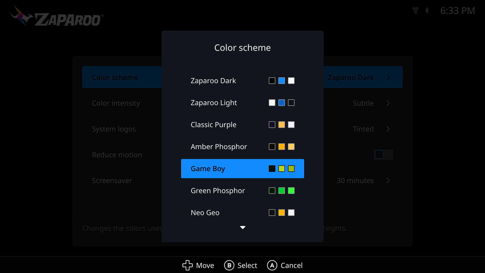
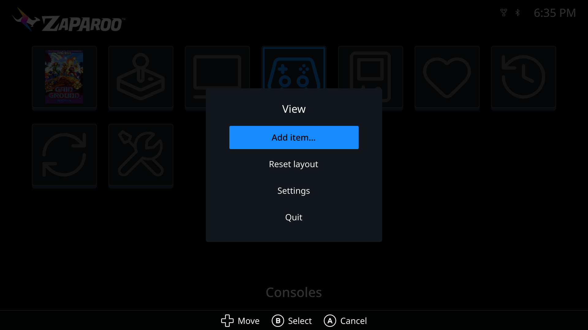
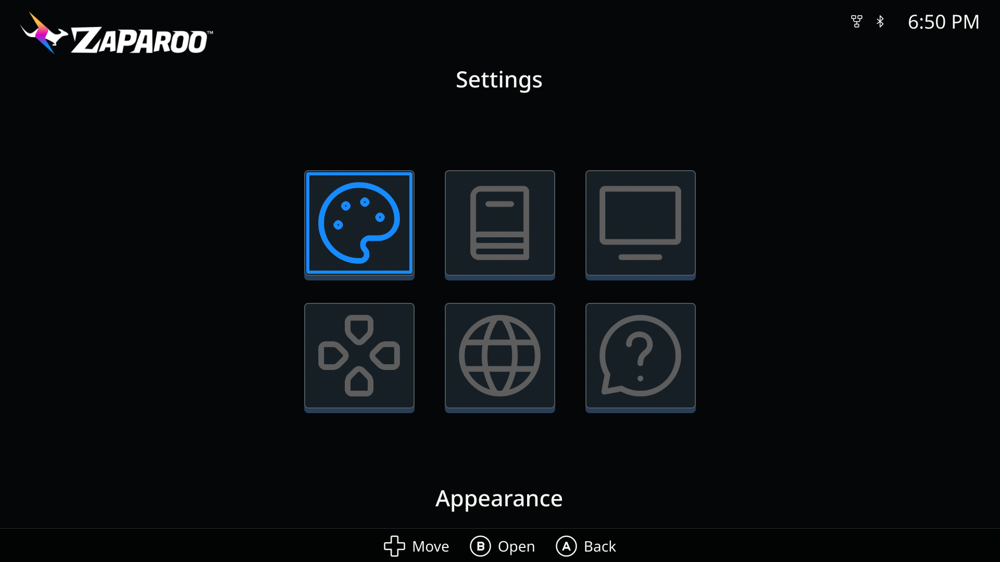
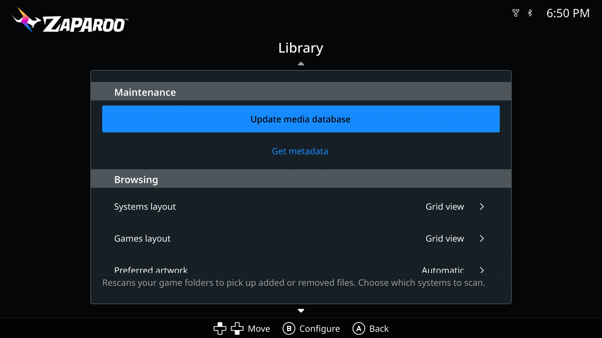

import Gallery from "@site/src/components/Gallery";
import hubDarkImage from "./hub_zaparoo_dark.png";
import hubLightImage from "./hub_zaparoo_light.png";
import hubGameBoyImage from "./hub_game_boy.png";
import gamesGridImage from "./games_grid.png";

[Zaparoo Frontend](/docs/frontend/) v1.3.0 and [Zaparoo Core](/docs/core/) v2.17.1 are now available. Update All installs both together.

Frontend is a lot faster and has a new look, plus a Hub you can arrange yourself, a reorganized settings menu, and a MiSTer Main build that adds kiosk mode and CRT settings to the OSD. Core v2.17.1 is a patch release that fixes problems found after v2.17.0, most of all RetroDECK and EmuDeck games that would not launch on Linux and SteamOS, and arcade games on MiSTer that registered as closed the moment they started.

Thank you to [Giancarlo Erra](https://github.com/giancarloerra) for the paging, random picks, favorites controls, and performance work, [Peter Brittain](https://github.com/KindarConrath) for grouping favorites by system, [theypsilon](https://github.com/theypsilon) for the updater improvements, and [Wilfried Jeanniard](https://github.com/willoucom) for the French translation.

{/* truncate */}

<Gallery captions={false} media={[
  { src: hubDarkImage, width: 1920, height: 1080, alt: "Zaparoo Frontend Hub in the Zaparoo Dark color scheme" },
  { src: hubLightImage, width: 1920, height: 1080, alt: "Zaparoo Frontend Hub in the Zaparoo Light color scheme" },
  { src: hubGameBoyImage, width: 1920, height: 1080, alt: "Zaparoo Frontend Hub in the Game Boy color scheme" },
  { src: gamesGridImage, width: 1920, height: 1080, alt: "Zaparoo Frontend games grid with box art" },
]} />

**Frontend highlights:**

- **[Much faster](#much-faster)**: quicker startup, browsing, paging, cover loading, and launching
- **[New look](#new-look)**: a rebuilt theme, 19 color schemes with a Color intensity setting, new controller glyphs, redrawn menus and dialogs
- **[Arrange the Hub](#arrange-the-hub)**: add systems, folders, and games as tiles, then move, hide, or remove them
- **[Redesigned settings](#settings)**: Appearance, Library, Display, Controls, Language, and About, with a description on every row
- **[Update metadata](#update-metadata)**: a clearer import dialog that remembers your source, and a per-game entry
- **[Per-game launchers and random picks](#launching)**: change the launcher for one game, or pick a random game or favorite
- **[French translation](#languages)**: plus translated category names and game details
- **[MiSTer](#mister)**: battery indicator, output-aware resolution, an updated built-in updater, and a Main build with kiosk mode, auto-save, disc autorun, and CRT settings in the OSD

## Download

### Frontend

<Button
  icon={<FAIcon icon="download" />}
  label="Download Frontend v1.3.0"
  link="https://github.com/ZaparooProject/zaparoo-frontend/releases/tag/v1.3.0"
  variant="primary"
/>

<Button
  icon={<FAIcon icon="link" />}
  label="Install Guide"
  link="/docs/frontend/setup/"
  variant="primary"
/>

<Button
  icon={<FAIcon icon="fa-brands fa-github" />}
  label="Frontend GitHub"
  link="https://github.com/ZaparooProject/zaparoo-frontend/"
  variant="primary"
/>

The release is live through MiSTer **Update All**, on GitHub Releases, and through Frontend's built-in updater.

### Core

<Button
  icon={<FAIcon icon="download" />}
  label="Download Core v2.17.1"
  link="https://zaparoo.org/downloads#zaparoo-core"
  variant="primary"
/>

<Button
  icon={<FAIcon icon="fa-brands fa-github" />}
  label="Core GitHub"
  link="https://github.com/ZaparooProject/zaparoo-core/"
  variant="primary"
/>

## Before you update

- **Frontend needs Core v2.17.0 or newer.** Update All installs Frontend v1.3.0 and Core v2.17.1 together, so this only matters if you install Frontend by hand. Older Core still connects with a warning, but library actions expect the new API.
- **Frontend now renders at up to 720p by default.** On a 1080p display the interface runs at 960 by 540, and on 1440p at 1280 by 720, integer-scaled to your output. If you want full 1080p, pick it under **Settings > Display > Interface resolution**; that mode runs with animations off. This prepares for a rendering change in the next release.
- **Settings migrate once.** Browsing layout is now separate Systems and Games layouts, Button style resets to Automatic, Re-scrape existing moved into the Update metadata dialog as Replace existing, the alternate-versions setting is gone (always on for Arcade), and categories you had hidden stay off the Hub until you add them back with **Add item...** in the Hub's View menu.
- **API clients:** Core methods that return nothing now answer with `null` instead of `{}`, and a ZapScript longer than 8192 bytes is rejected. See [Core v2.17.1](#library-api-and-readers).
- **Zaparoo Companion gamelist users:** run **Update metadata** with **Replace existing** once after updating Core, to fix artwork that was attached to the wrong game.

## Speed and style

### Much faster

Frontend and Core were optimized together:

- With Core v2.17.0 or newer, opening a system goes straight to its games, and Core tells Frontend up front which games have covers, so it stops asking for images that do not exist.
- Long lists scroll and page more smoothly, and cover art is cached more sensibly.
- System logos and icons no longer pop in, and Hub covers are on screen from the first frame after boot.
- Returning to a page deep in a big list no longer freezes the interface, and launching responds a frame after you press the button.

Thanks to [Giancarlo Erra](https://github.com/giancarloerra) for a large share of this work.

### New look

- The theme was rebuilt around three colors per preset, and there are 19 presets under **Settings > Appearance**: Zaparoo Dark and Light, Classic Purple, Amber Phosphor, Game Boy, Green Phosphor, Neo Geo, NES, Virtual Boy, Dracula, Everforest, Gruvbox, Nord, Oxocarbon, Rosé Pine, Solarized Dark, Synthwave '84, Flexoki Paper, and Solarized Light.
- **Color intensity**, also under Appearance, keeps the default Subtle look or switches to Vivid for stronger tile edges and selection highlights. Selected rows now use a softer tint of the accent color so text stays readable on every scheme.
- The circuit-board background is gone, the Zaparoo logo is rendered at the right size for each screen and scheme, and status icons follow the theme so light schemes work.
- New controller glyphs (Kenney's CC0 set) with a fifth style, one selection style across menus, pickers, and settings, dialogs that size to their content, and a redesigned game details dialog.
- Numbers use your locale's digit grouping.

## Hub and browsing

### Arrange the Hub

The Hub is now a grid you lay out yourself. Tiles can be categories, the built-in Resume, Favorites, Recently played, Update, and Settings actions, systems, folders, or games.

- **Add to Hub** from the options menu of any system, folder, game, favorite, or recent item, or **Add item...** from the Hub's View menu. A system stored on more than one drive can pin each of its folders, and pinning a folder that holds a single game pins the game itself.
- Each tile's options menu offers **Move**, plus **Hide** for categories and actions or **Remove** for tiles you added. **Reset layout** puts everything back.
- Tiles that cannot run stay put with a reason, such as **No recent games**, instead of disappearing, and Resume names the game it will resume.
- The Hub keeps your place across a MiSTer relaunch, and B no longer quits Frontend from the Hub. Quit moved into the View menu.

The layout is saved under `[[hub.items]]` in `frontend.toml`; see [configuration file](/docs/frontend/customization/#configuration-file).

### Browsing

- Systems stored on more than one drive show the root beside duplicate names, and folders show an item count.
- The letter jump works at a system's root, and Left and Right page a whole screen in list layout.
- The top status strip shows the page in grid layouts and your place in the list in list layout.
- The game details dialog says **This game's file is missing.** when Core can no longer find the file, and its metadata table is translated, with short labels on small screens.
- Box art that failed to load during a NAS mount race recovers once the system finishes indexing.

### Favorites and recents

- Group favorites by system through a new Favorite Systems screen, contributed by [Peter Brittain](https://github.com/KindarConrath).
- Sort favorites by default order or A to Z, and filter the games list to favorites only.
- **Random favorite** picks from your favorites.
- Recently played and Favorites now page past the first screen.

## Launching

- **Change launcher** works on a single game as well as a system, and shows the current choice inline.
- **Random game** picks from the current system through Core's `launch.random`.
- Confirm on a game launches it, so game menus no longer carry a **Launch game** entry. **Details** comes first instead.
- **Write with phone** is now **Write with App**, with a clearer prompt to scan the code with the Zaparoo App. Two games could share one code before; each game now gets its own.
- **Launch core** is now **Launch system**.
- Alternate arcade versions are always discovered for Arcade games; the setting is gone.
- A Hub shortcut to a launch-only system launches it instead of opening an empty list.

## Settings and library

### Settings

Settings are now Appearance, Library, Display, Controls, Language, and About, and every row has a description.

- **Library** puts **Update media database** and **Update metadata** at the top, each with a dialog to choose systems, and splits the browsing layout into Systems and Games layouts.
- **Controls** detects your controller for button icons, adds a fifth icon style, and can swap confirm with cancel or Options with View.
- **Display** offers exact divisors of your current output as **Interface resolution** (see [Before you update](#before-you-update) for the new default), resets a refused mode to Automatic, re-detects the output while running, and adds **Interface layout**: Device default, Standard, or Handheld, which packs the Hub tighter for small screens.
- The first-run scan no longer blocks the interface. Indexing starts in the background while the Hub shows what is happening.

### Status line and error messages

A status line under the header replaces the status pill: connection state, the running task with a progress track, and short-lived messages such as playtime warnings. Failures open a dialog that names the action, such as **Launch failed**, with **Retry** and **OK**.

### Update metadata

The metadata action is now called **Update metadata** everywhere: the Library row, the system and category menus, and new entries on individual games, favorites, and recents.

- The dialog asks for a **Source**, the **Systems** to cover, whether to **Replace existing**, then **Start import**, and reminds you that Zaparoo imports artwork from files you already have rather than downloading it. Source and Systems open inside the dialog rather than on top of it.
- Frontend remembers the source you picked, and uses it when you update metadata for one system, category, or game from its menu.
- Starting from a system or category menu opens the same dialog, pre-scoped, instead of silently running the gamelist scraper with default options.
- **Settings > About** gains a **Documentation** row with a QR code for the Frontend guide.
- The Hub explains itself during the first scan (**Updating the media database**, then **No games found yet** if nothing turns up).

### Languages

French joins the interface languages, translated by [Wilfried Jeanniard](https://github.com/willoucom). Category names from Core and the game details table are now translated too, the language list is sorted, and the **System names** setting is now called **Region**.

## MiSTer

- Builds with a supported battery board show a battery icon and percentage in the header.
- On a 1080p output, Frontend renders an integer-scaled 960 by 540 scene resolved from the actual output.
- CRT layouts were reworked for 240p: the Hub shows 4 by 2 tiles, the help bar wraps to two rows, and PAL 288p uses the same layout.
- `--crt` no longer queues a restart on every launch.
- `frontend.toml` is edited in place, keeping your comments, and the write is skipped when nothing changed.
- The built-in updater is at version 1.0.1, with smoother progress and cleaner cancellation, thanks to [theypsilon](https://github.com/theypsilon).

### MiSTer Main changes

Frontend ships with [Zaparoo's build of MiSTer Main](/docs/platforms/mister/main/), and that build has moved on since the last Frontend release:

- **CRT settings in the OSD.** System Settings has a **Zaparoo** page with CRT mode, the video standard, and a Screen position adjuster that moves the picture live against a test pattern. It works even when Frontend is not running, so you can turn CRT mode on without an HDMI display.
- **Kiosk mode.** Locks the OSD completely, for setups where cards are the only way to start a game. Menu, F12, the front-panel button, and the keyboard combos stop opening it, while card launches and the screensaver keep working. Turning it on shows a warning, because getting back in takes a card that runs `zaparoo_osd open` or `zaparoo_kiosk off`, or deleting `config/zaparoo_settings.bin` from the SD card on a PC. Set that card up first. See [kiosk mode](/docs/platforms/mister/main/#kiosk-mode).
- **Frontend on and off.** The same page switches Frontend off and back on without editing `MiSTer.ini`.
- **Auto-save.** Off by default. When it is on, Main asks the running core to write its save before the next core loads, which adds about half a second to each launch. Switching the MiSTer off mid-game still loses the save.
- **Auto-run discs.** Off by default. Insert a CD or DVD while the menu is up and Main launches it through Physical Disc Support or mister-disc, or through the DVD core.
- **Commands for cards.** `zaparoo_save` forces a save, `zaparoo_mount` swaps a disk in a multi-disc game without reloading the core, and `zaparoo_cheat` turns cheats on and off, none of it through the OSD. See [commands](/docs/platforms/mister/main/#commands).
- **Game tracking without MiSTer.ini edits.** Main writes the running game to `/tmp/ACTIVEGAME` itself, so Core tracks games started from the MiSTer menu without `recents=1` and `log_file_entry=1`, and Main no longer forces those two settings on.
- **Core starts before the menu.** Main starts the Core service before anything else, so tokens work sooner after power on.
- **An opt-in Main log.** Create `/media/fat/zaparoo/main.log` and Main writes its output there across reboots, for support.
- **Fixed:** the first button press after boot was delayed by about a third of a second while controller mappings loaded.
- **Fixed:** Main restarts Frontend if it crashes, cleans up stale copies, keeps its framebuffer settings, and waits for a TV that powers up late, which fixes wrong-size or black starts.
- **Fixed:** a DualSense could lose its face buttons in Frontend when a keyboard dongle was plugged in too.
- **Fixed:** the OSD and menu stay out of the way while Core runs a script or video on the console.

## Core v2.17.1

Core v2.17.1 fixes problems found after v2.17.0. Install it the usual way for your platform; a device with `install = true` under `[updates]` picks it up on its own.

### Launching

- RetroDECK and EmuDeck games with an uppercase letter anywhere in their path could not launch on Linux, Bazzite, ChimeraOS, and SteamOS. Launcher checks were handed a lowercased path, which never matched on a case-sensitive filesystem. See [RetroDECK](/docs/platforms/linux/launchers/#retrodeck) and [EmuDeck](/docs/platforms/linux/launchers/#emudeck).
- The same bug stopped [AmigaVision](/docs/platforms/mister/launchers/#amigavision-amiga) launching on MiSTer when the Amiga folder lives on an ext4 drive rather than the SD card, and turned its listing files into launch targets that could only fail.
- `launch.title` and `@System/Title` could boot the first `.bin` track of a disc folder instead of its `.cue` or playlist. Wrong entries already cached are cleared on upgrade.
- [`**control`](/docs/zapscript/utilities/#control) failed against native audio with `launcher not found: native-audio`, `**control:stop` left the track reported as playing, and after `launchers.refresh` or a MiSTer RBF rescan even `media.control` could not stop it.

### MiSTer

- Arcade games registered as closing the moment they launched, leaving zero-second play sessions. This was a regression in v2.17.0.
- Hold mode never stopped a game from `_Arcade/_alternatives` whose set name is missing from `ArcadeDatabase.csv`, and those games were not tracked when started from the MiSTer menu.
- Scans of exFAT and FAT storage stopped reading a folder at the first symlink, so everything after it was missing from the library. One log showed 1450 truncated folders under `_Arcade/_alternatives`. Run a media database update after installing.
- A per-reader [`scan_mode`](/docs/core/config/#scan-mode) was ignored when the reader was configured with an older driver ID such as `pn532_uart`.

### Library, API, and readers

- Browsing a folder with around a thousand subfolders took 30 seconds and then showed them all as plain folders. The same page now resolves in a couple of seconds, and disc folders with more than 64 files are recognized as games too.
- A page of token history could take over a minute to load on a busy device. ZapScript is now capped at 8192 bytes, on every reader, the `run` method, Zap Links, and mapping overrides, so parsing stays bounded. An NTAG216 holds 888 bytes.
- Scrape progress stopped updating during a scrape when encryption was optional, because notifications sent before a client's first frame went out unencrypted and desynced it.
- Zaparoo Companion gamelists could attach artwork to the wrong game when one file was listed under two titles, such as Crash Bandicoot 3 getting Crash Bandicoot's box art. New scrapes match correctly; run Update metadata with Replace existing to fix existing entries.
- Methods that return nothing now answer with `null` instead of `{}`, which is what the [API reference](/docs/core/api/) always said. `media.control`, `settings.backup.delete`, `mappings.new`, `clients.delete`, and `clients.pair.cancel` are the five whose documented result changes, and `zaparoo -api` prints `null` for them.
- USB reader topology paths came back empty on every Linux host, so USB reader IDs change once after this update. They are runtime identifiers and nothing in your config refers to them.

---

As always, feedback and bug reports are welcome on our [Discord](https://zaparoo.org/discord), [Frontend GitHub](https://github.com/ZaparooProject/zaparoo-frontend/), or [Core GitHub](https://github.com/ZaparooProject/zaparoo-core/).

<SponsorCallout variant="combined" />
