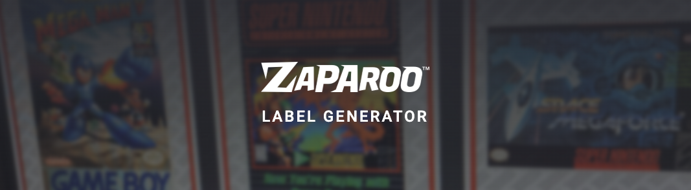

The Zaparoo Designer's URL has changed to a new location. Please update your bookmarks to the new location:

`https://design.zaparoo.org`

The Designer was accessible on a few different URLs before, but this is now the canonical location for it going forward. Some redirects for the old URLs are in place where possible but it's best to just update your bookmarks yourself to the new location. It's also linked on the [home page](/) of this site and on [the Wiki](https://wiki.zaparoo.org/).

Updated templates are still in progress. Just to be clear again, as per the [Terms of Use](/terms/) and the [original announcement](/news/tapto-to-zaparoo/) of the name change, all templates going forward won't have any Zaparoo logos or branding on them. The initial new ones will simply have the TapTo logo removed or replaced with one of the generic marks in the [Zaparoo Media](https://github.com/ZaparooProject/zaparoo-media) repository.


 Go to the Designer
 


