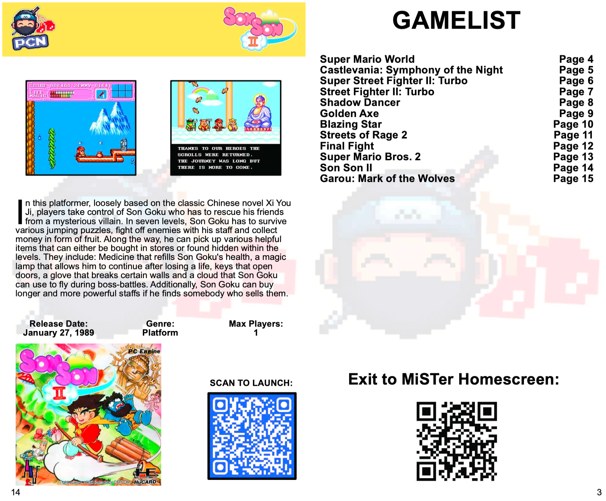

In this community spotlight I want to show off an awesome project by [Anime0t4ku](https://x.com/TandiLogan). They've created a printable booklet that lets you browse and launch a selection of games from [Pixel Cherry Ninja's](https://www.youtube.com/c/PixelCherryNinja) favorites using QR codes and the Zaparoo App.

I really love this idea and I hope to see more projects like this that take advantage of the feature. It's really cool to be able to show people your favourite games this way. Much more interesting than a plain list.

If you want to make your own QR codes, I've published a [guide on the wiki](https://wiki.zaparoo.org/QR_codes) with instructions. In the upcoming version of Zaparoo Core there will also be some new features to make remapping them easier.


 Download the booklet PDF

