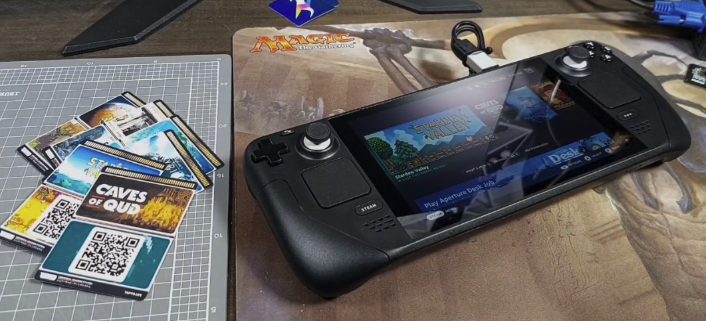

Zaparoo works on the Steam Deck! An initial release of Zaparoo Core is now available to try on SteamOS on the Steam Deck. This is a beta release and has some rough edges, but if you're comfortable running some commands in a terminal you can try it out right now.

This release is compatible with the Zaparoo App, PN532 readers and ACR122U readers. It supports launching and searching Steam games.

A guide is available on the Wiki to help you get started:


 Install Guide

