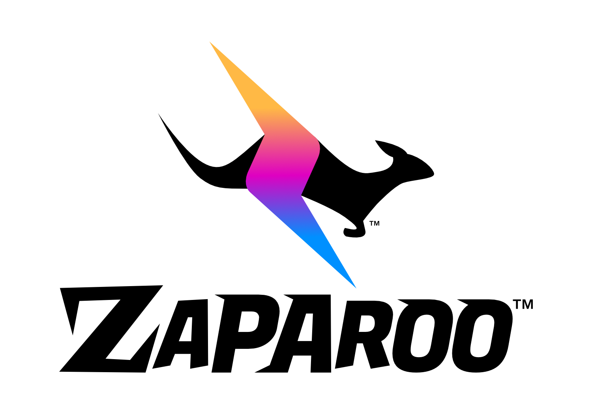
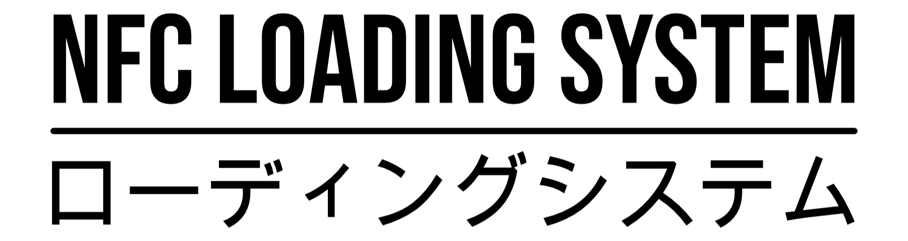

TapTo will now be called Zaparoo! All directly associated [projects](/projects/) will be rebranded to reflect this name change. The name Zaparoo is also in the process of being trademarked and will have very different terms of use compared to TapTo.

I’ll be thoroughly explaining why in this announcement to make sure everyone is on the same page

## TL;DR

- The TapTo name and all directly associated projects are being rebranded to Zaparoo with old links (tapto.wiki, tapto.life, etc.) being redirected indefinitely.
- Zaparoo is being trademarked and will have stricter terms of use (at least to start) that require express permission from me to use (except of course for fair use).
- The Zaparoo logos must not be put on labels or hardware projects anymore without express permission from me (please). We are releasing alternate graphics in the meantime.
- Not much else about TapTo is changing; it will remain open source, community-driven and have accessible options available for everyone.

## Why the change?

The main reason for this change is because recently a US trademark was finalized for the name "TapTo" in an NFC-related category along with a logo that is _kind of_ similar to the TapTo logo. The trademark was originally filed only a few weeks before we started using the TapTo name ourselves, so it was just a really unfortunate coincidence.

Most of the TapTo projects are hosted in the US. Most of the TapTo community is in the US. The TapTo Life app is hosted by Apple and Google in the US. It's entirely possible that the trademark holder could take action against the project, and they may be well within their rights to do so.

To be totally clear as well, at this point I have not received any communication from the trademark holder. I'm not even sure they're aware of the project. But it's not something I can ignore either.

Some other considerations I had:

- Commercial projects are hesitant about integration with and associating with a project that is owned by "nobody". I’m committed to making TapTo work with _everything_ possible.
- Related to that, if some nefarious third party wanted to try take over the name... I kind of have to pound sand. This change gives me a lot more control and recourse to protect the project from people who might want to harm it or the community. Hasn't happened, but you never know.

I had two choices:

1. Hire a lawyer to investigate and perform a risk assessment of the TapTo name, then try to trademark it in a way that doesn’t conflict with the existing trademark if the risk was low enough.
2. Organize a new name and brand, and trademark that instead.

And now here we are, you can guess which way I went. I really believe TapTo has a long future ahead and I’m sure this name change will end up as a minor road bump in its history.

## I don’t like the new name!

Sorry! I can only say give it a chance. It's really grown on me quickly and I love the vibe of the new branding from [Tim](https://timwilse.art). It's a fresh start for the project on the right footing.

I must have gone through hundreds of new potential names. It's very difficult to find a name that doesn't already exist, isn't similar to something else, isn't absolute startup word salad, doesn't have some existing presence online, mean something negative, infringe on another trademark, and so on and so on. It's not as easy as you might first think.

Ultimately, whatever I chose, not everyone was going to like it. Hopefully over time people will adjust and warm up to it.

## Who owns the trademark?

I do. Specifically, a company I created for this purpose does. This company will own the rights, and license them out for use by the official open source projects.

## Can I use the Zaparoo name or logo on my work?

Right now, _no_. Going forward, I hope so, but I don’t know yet. This is all new to me and unfortunately the answer to every question I have is "ask a lawyer" which racks up in costs very quickly. I need to take time to assess everything and make sure I’m asking the most cost-effective questions, so please give me that time to work it out.

This is the worst part of the change for me. When I first set up the terms of use for TapTo, I had these big dreams about it being this awesome open source free-for-all where everyone who is proud to associate with the project can use it. It turns out it just doesn’t really work that way and comes with a lot of disadvantages and risks.

My ideal setup is one where there is a very clear and straightforward guide available for fair use, a streamlined process for requesting use for non-commercial open source projects and an avenue for commercial use. Whether this is possible or not remains to be seen though. I will keep everyone updated!

For now:

- Please do not use the Zaparoo name to imply your work is officially associated with the Zaparoo brand.
- Please do not use the new Zaparoo logos on anything (no more sticking the logo on labels like has been normal with TapTo).

You hear about it with all the big companies, I really am obligated to do something about it if someone is using it without permission.

### NFC and Univeral Loading System graphics

In case people want _something_ to put on their labels, Tim has very kindly offered to release the set of Universal Loading System graphics that were being used on the existing TapTo hardware sold by us. They will be available in the Zaparoo Media repository alongside the existing NFC Loading System files.

I think this will be a good compromise for now, and I hope it will be useful to people who want some recognizble way to show a card works with the project.

## Can I keep using the TapTo name and logo on my work?

Sure. You can obviously put whatever you like on your own stuff. The terms of use on the logo created by [Ranny](https://x.com/RannySnice) still stand, and I will speak to him about changing them to how he feels is best if necessary. I’ll keep a page up on the wiki for posterity about the TapTo name and logo as well. There’s a whole heap of TapTo branded stuff out there now, I can only say please continue to enjoy it and use it as it was meant to be. I certainly will.

If you are _selling_ TapTo branded stuff, I would highly recommend removing that branding as soon as you can, for the same reasons I am doing so for the project. Ultimately though that is also up to you.

## Is TapTo going commercial?

Not really any more than it was already. There are already many examples of TapTo being used commercially, and rightly so, because I specifically set up the project to work that way. I am a strong believer in the idea that commercial use underpins the long-term success of an open source project. If it’s viable, I will be using the company to directly benefit the open source projects, which is something I’ve always dreamed of being able to do.

There is a question of governance and how to navigate the commercial side of things alongside the open source projects. I'll be tackling that when (and if) the project continues to grow, otherwise I will be too bogged down in administrative work to do anything else. I really want what's best to keep the community healthy so please be patient with me as I work it out.

## What’s next?

That’s all for now. There’s going to be a lot of cool changes coming with Zaparoo but they’ll take time. I’m super excited about where the project is heading, and I think people will have heaps of fun with it.

The name changeover is going to be a big job and won’t happen all at once. Also, I apologize for making this a big surprise. It was unfortunately necessary to make sure everything went ok. I’ve announced it as soon as I was able to and it is the result of a few mad weeks, not a long-term plan.

Big thank you to [Tim Wilsie](https://timwilsie.art/) for designing the new brand artwork for the project! Another big thank you to [Ranny Snice](https://x.com/RannySnice) who designed the original TapTo logo and was so kind as to let us use it this year.

I appreciate everyone who has contributed to the project so far, and I hope I can keep steering the ship in a way where everyone keeps having a blast making cool stuff that makes computers do other cool stuff.
