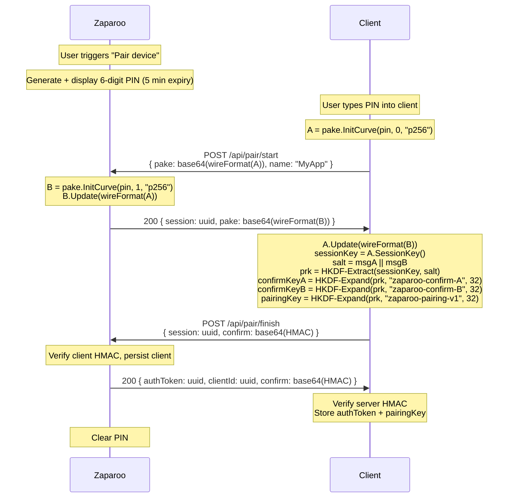

# API Encryption

Zaparoo encrypts WebSocket traffic using PAKE-based pairing and AES-256-GCM with per-session HKDF-derived keys. This is the wire protocol reference for client implementors.

## Overview

- **Pairing**: One-time PAKE2 (P-256) handshake. User enters a 6-digit PIN from the Zaparoo device into the client app. Both sides derive a shared 32-byte pairing key. The PIN is never transmitted.
- **Encryption**: AES-256-GCM with counter-derived nonces on every WebSocket frame.
- **Per-session keys**: Each WebSocket connection generates a random 16-byte session salt. Both sides derive ephemeral keys via HKDF-SHA256 (pairing key as IKM, session salt as HKDF salt).
- **Scope**: WebSocket only. HTTP POST, SSE, and REST GET are localhost-restricted by default.

## Configuration

Set `encryption` in `[service]` of `config.toml`:

| Value | Behavior |
|---|---|
| `false` (default) | No encryption. All WebSocket connections accepted as plaintext. |
| `true` | Remote WebSocket connections must send an encrypted first frame from a paired client. Localhost plaintext connections still work without pairing. |

## Pairing flow

Two HTTP round trips establish a shared 32-byte pairing key.



### HMAC transcript

Confirm HMACs use length-prefixed encoding:

```text
LP(field) = 4-byte big-endian uint32 length || field bytes
```

Full transcript:

```text
LP("zaparoo-v1") || LP("p256") || LP(role) || LP(clientName) || LP(MsgA) || LP(MsgB)
```

Where `role` is `"client"` or `"server"`, and `MsgA`/`MsgB` are the **raw bytes sent over the wire** (not the result of calling `pake.Bytes()` again after `Update()`).

### PAKE message format

The `pake` field in `/pair/start` request and response carries a base64-encoded JSON object. The PAKE protocol is based on [schollz/pake](https://github.com/schollz/pake) v3 using the P-256 curve. Coordinates are string-encoded for cross-language compatibility.

| Field | Type | Description |
|---|---|---|
| `role` | number | `0` (initiator/client) or `1` (responder/server) |
| `ux` | string | U-point x-coordinate, decimal integer |
| `uy` | string | U-point y-coordinate, decimal integer |
| `vx` | string | V-point x-coordinate, decimal integer |
| `vy` | string | V-point y-coordinate, decimal integer |
| `xx` | string | X-point x-coordinate, decimal integer |
| `xy` | string | X-point y-coordinate, decimal integer |
| `yx` | string | Y-point x-coordinate, decimal integer |
| `yy` | string | Y-point y-coordinate, decimal integer |

All coordinate values are arbitrary-precision integers encoded as **quoted decimal strings** (not bare JSON numbers). This avoids precision loss in JSON parsers that use IEEE 754 doubles. Fields for points not yet computed in the current protocol step are `"0"`.

Example client message (role 0, message A, Y not yet computed):

```json
{
  "role": 0,
  "ux": "793136080485469241208656611513609866400481671852",
  "uy": "59748757929350367369315811184980635230185250460108398961713395032485227207304",
  "vx": "1086685267857089638167386722555472967068468061489",
  "vy": "9157340230202296554417312816309453883742349874205386245733062928888341584123",
  "xx": "48439561293906451759052585252797914202762949526041747995844080717082404635286",
  "xy": "36134250956749795798585127919587881956611106672985015071877198253568414405109",
  "yx": "0",
  "yy": "0"
}
```

### Pairing limits

- **PIN**: 6 decimal digits, `crypto/rand`. ~20 bits of entropy.
- **Expiry**: 5 minutes from PIN generation.
- **Attempts**: 3 failed HMAC verifications per PIN before invalidation.
- **Sessions**: `/pair/start` session expires after 2 minutes.
- **Client name**: max 128 bytes.
- **Max paired clients**: 50 per device.
- **Rate limit**: 1 req/sec per IP on `/api/pair/*`.

## Message format

Every encrypted WebSocket connection starts with a first frame that establishes the session.

### First frame (client → server)

```json
{
    "v": 1,
    "e": "<base64(ciphertext)>",
    "t": "<authToken>",
    "s": "<base64(sessionSalt)>"
}
```

| Field | Description |
|---|---|
| `v` | Protocol version. Currently `1`. Server returns a plaintext error if unsupported (see [Errors](#errors)). |
| `e` | AES-256-GCM ciphertext of the JSON-RPC request, base64-encoded. |
| `t` | Auth token (UUID) identifying the paired client. Not a secret; used for key lookup only. |
| `s` | 16-byte random session salt, base64-encoded. Must be exactly 16 bytes. |

### Subsequent frames (both directions)

```json
{
    "e": "<base64(ciphertext)>"
}
```

Counters are implicit: both sides start at 0 and increment per frame. WebSocket guarantees ordering. If decryption fails, the connection is closed.

Server notifications (e.g. `media.started`) use this same format, encrypted with the session keys.

### Decrypted payload

Standard JSON-RPC 2.0:

```json
{
    "jsonrpc": "2.0",
    "method": "version",
    "params": {},
    "id": 1
}
```

## Session cryptography

Each WebSocket connection derives its own ephemeral keys from a fresh random session salt.

### Key derivation

```text
prk     = HKDF-Extract(SHA-256, ikm=pairingKey, salt=sessionSalt)
c2sKey  = HKDF-Expand(SHA-256, prk, info="zaparoo-c2s-v1",       length=32)
s2cKey  = HKDF-Expand(SHA-256, prk, info="zaparoo-s2c-v1",       length=32)
c2sBase = HKDF-Expand(SHA-256, prk, info="zaparoo-c2s-nonce-v1", length=12)
s2cBase = HKDF-Expand(SHA-256, prk, info="zaparoo-s2c-nonce-v1", length=12)
```

### Nonces

12-byte AES-GCM nonce per frame: XOR a big-endian counter into the last 8 bytes of the nonce base:

```text
nonce[0:4]  = base[0:4]
nonce[4:12] = base[4:12] XOR (counter as 8 bytes big-endian)
```

Counters don't wrap. Disconnect and reconnect with a fresh salt to start over.

### AAD

All encrypt/decrypt operations bind ciphertext to the session:

```text
aad = authToken + ":ws"
```

## Security limits

- **Salt reuse**: The server rejects duplicate session salts per client (200-entry / 10-minute sliding window). Always use a CSPRNG for session salts.
- **Failed frames**: 10 consecutive first-frame decryption failures per (authToken, IP) triggers a 30-second block with exponential backoff, capped at 30 minutes.

## Client dependencies

**Pairing** needs raw P-256 elliptic curve point arithmetic:

| Platform | Library |
|---|---|
| JavaScript | [`@noble/curves`](https://github.com/paulmillr/noble-curves) |
| Python | `ecdsa` or `cryptography` |
| Swift | [Swift Crypto](https://github.com/apple/swift-crypto) |
| Kotlin/Android | Bouncy Castle `ECPoint` |
| C#/.NET | BouncyCastle NuGet |
| Rust | `p256` crate |

**Per-connection encryption** is just HKDF-SHA256 + AES-256-GCM + HMAC-SHA256, all in platform stdlibs (Web Crypto, CryptoKit, JCE, .NET, RustCrypto).

## Client key storage

| Platform | Recommended storage |
|---|---|
| iOS | Keychain |
| Android | EncryptedSharedPreferences / Keystore |
| Web/Electron | OS keychain via `keytar` or similar |
| CLI tools | File mode `0600` in user config directory |

Store both the pairing key (32 bytes) and auth token (UUID). The auth token isn't secret, but it's bound to the key. Lose either and you need to re-pair.

## Errors

HTTP errors on pairing endpoints:

| Status | Endpoint | Meaning |
|---|---|---|
| 400 | `/pair/*` | Malformed request body or PAKE message |
| 401 | `/pair/finish` | HMAC mismatch (wrong PIN) |
| 403 | `/pair/start` | Max paired clients reached, or attempts exhausted |
| 404 | `/pair/finish` | Unknown session ID |
| 410 | `/pair/*` | Pairing PIN expired |
| 429 | `/pair/*` | Rate limit exceeded |

WebSocket errors (plaintext JSON-RPC error, then connection closed):

| Code | Meaning |
|---|---|
| -32001 | Unsupported encryption version |
| -32002 | Encryption required. Remote clients must send an encrypted first frame. |

## Connection lifecycle

If the client doesn't know whether encryption is on:

1. Try connecting plaintext.
2. If the server returns `-32002`, you need to pair first.
3. Prompt the user to start pairing from the Zaparoo device.
4. Run the PAKE handshake (`/pair/start` → `/pair/finish`). Derive `pairingKey` locally via HKDF (see [Pairing flow](#pairing-flow)). Store `authToken` and `pairingKey`.
5. On future connections: fresh session salt, derive session keys (see [Session cryptography](#session-cryptography)), send the encrypted first frame.

## Non-WebSocket transports

HTTP POST, SSE, and REST GET (`/api`, `/api/events`, `/r/*`, `/run/*`) are localhost-only by default. Add IPs or CIDR ranges to `allowed_ips` in config for remote access. No encryption on these transports, they're for simple integrations on trusted networks. API key auth still applies.

## Pseudocode example

Encrypted session lifecycle, assuming pairing is already done:

```text
function connect(url, authToken, pairingKey):
    sessionSalt = random_bytes(16)

    // Derive per-session keys via HKDF-SHA256
    prk     = hkdf_extract(sha256, ikm=pairingKey, salt=sessionSalt)
    c2sKey  = hkdf_expand(prk, info="zaparoo-c2s-v1",       len=32)
    s2cKey  = hkdf_expand(prk, info="zaparoo-s2c-v1",       len=32)
    c2sBase = hkdf_expand(prk, info="zaparoo-c2s-nonce-v1", len=12)
    s2cBase = hkdf_expand(prk, info="zaparoo-s2c-nonce-v1", len=12)

    aad         = encode(authToken + ":ws")
    sendCounter = 0
    recvCounter = 0

    ws = websocket_connect(url)

    function send(method, params):
        payload = json_encode({ jsonrpc: "2.0", method, params, id: next_id() })
        nonce   = xor_counter(c2sBase, sendCounter)
        ct      = aes_gcm_encrypt(c2sKey, nonce, aad, payload)
        frame   = { e: base64(ct) }
        if sendCounter == 0:
            frame.v = 1
            frame.t = authToken
            frame.s = base64(sessionSalt)
        sendCounter++
        ws.send(json_encode(frame))

    function on_receive(raw):
        frame = json_decode(raw)
        nonce = xor_counter(s2cBase, recvCounter)
        pt    = aes_gcm_decrypt(s2cKey, nonce, aad, base64_decode(frame.e))
        recvCounter++
        return json_decode(pt)

    return { send, on_receive }
```
